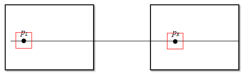
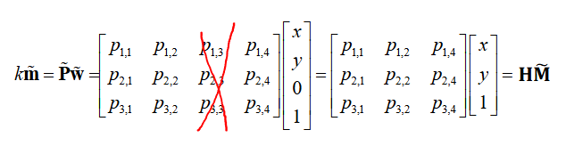
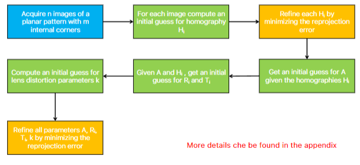

#### APPUNTI DI GIUSEPPE SPATHIS

## PINHOLE CAMERA MODEL
per rappresentare un'immagine si una un image device che raccoglie la luce riflessa da oggetti in 3d e la usa per creare l'immagine in 2d

il piu' semplice image device e' il pinhole camera model in cui la luce va dentro il pinhole e poi arriva fino all'image plane, se vedi nell'image plane l'oggetto e' al contrario

il modello geometrico per la formazione dell'immagine nel pinhole camera model e' chiamato perspective projection (proiezione prospettica)

- I e' image plane (qua l'immagine e' rovesciata)
- c e' centro dell'immagine nell'image plane
- m e' il corrispettivo punto 2d nell'immagine di M (punto 3d)
- C e' in pinhole
- f e' il focal length
- F e' il focal plane (qua l'immagine non e' rovesciata)
- M e' il punto della scena (punto 3d)

dobbiamo capire che relazione c'e' fra i punti in 2d e quelli in 3d

aggiungiamo le varie coordinate al nostro perspective projection

gli assi (u,v) e (x,y) devono essere paralleli (come si vede in figura)

$$
\begin{equation}
u = -x \frac{f}{z}; \quad v = -y \frac{f}{z}
\end{equation}
$$

L'equazione (1) rappresenta la mappatura da punti in 3d a punti in 2d, normalmente pero' noi non vogliamo l'immagine nell'image plane rovesciata e quindi togliamo il meno -

$$
\begin{equation}
u = x \frac{f}{z}; \quad v = y \frac{f}{z}
\end{equation}
$$

$\frac{f}{z}$ rappresenta la scala dell'immagine in 2d, piu' M e' lontano dal pinhole e quindi piu' z incrementa e piu' l'immagine risultera' piccola nell'immagine plane, viceversa se incrementiamo la focal length l'immagine 2d sara' piu' grande

questo significa che a una imagine 2d corrispondono infinite immagini 3d a differenti profondita', quello che perdiamo noi mappando da 3d a 2d e' proprio la profondita', recuperare la profondita' e' un ill-posed problem.
Invece a una immagine 3d corrisponde solo un'immagine 2d

## STEREO VISION

per recuperare la profondita' usiamo lo stereo vision ovvero usare piu' immagini, almeno 2

assumiamo che: 
- (x,y,z) delle due camere siano paralleli quindi significa che le due camere non sono ruotate in maniera diversa l'una con l'altra e che guardano lo stesso oggetto
- hanno la stessa focal length f

$O_L$ e $O_Z$ sono i pinhole delle due camere, $p_L$ e $p_Z$ sono i punti 2d nell'immage plane (sarebbero m piccolo), P e' il punto 3d di cui vogliamo calcolare la profondita'

la distanza fra le due camere e' chiamata baseline 

$d=u_L - u_R$ e' chiamata disparita' e sarebbe la differenza orizzontale di uno stesso punto 3d in due camere leggermente distanziate, sarebbe quanto un punto 3d si sposta in base alla camera, piu' l'oggetto e' vicino alla camera e piu' la disparita' sara' grande 
la disparita' sarebbe quando con gli occhi chiudi un occhio e l'oggetto si sposta tipo un po a sx o dx

$$
\begin{equation}
z = b \frac{f}{d}
\end{equation}
$$

l'eq (3) e' la relazione fondamentale in stereo vision

il fatto e' che noi abbiamo due immagini ma non i corrispettivi $p_L$ e $p_Z$ noi semplicemente prendiamo un punto $p_L$ nella prima immagine e poi dobbiamo calcolare la corrispondenza nella seconda immagine ovvero calcolare $p_Z$, per calcolarlo vediamo sulla stessa linea dei pattern o colori simili.
Questo problema e' chiamato stereo correspondence

#### VANISH POINT
nel nostro sistema geometrico prespective projection proporzioni e parallelismo nello spazio 3d non vengono mantenuti nello spazio 2d (tranne per linee parallele all'image plane).

Quando linee parallele nello spazio 3d vengono proiettate in un'immagine, appaiono convergere in un punto comune chiamato vanish point, se le linee sono parallele all'image plane allora rimangono parallele pure nell'immagine 2d e quindi il vanish point e' all'infinito

### DEPTH OF FIELD
Depth of Field sarebbe la distanza in cui l'immagine e' a fuoco, nel pinhole e' infinita quindi sempre e' a fuoco.
l'immagine 2d e' senza blur se tutti i raggi di luce che passano dal pinhole arrivano all'image plane nello stesso momento, questo succede nel pinhole camera system perche' il pinhole e' piccolo ma comporta il problema che possiamo catturare poca luce, se invece decidiamo di allargare il buco dobbiamo affrontare il problema del focus e per il risolvere il blur aumentiamo l'esposizione (quindi aumentiamo il tempo di cattura della luce), questo pero' non si puo' fare per oggetti che si muovono senno' si crea il motion blur

#### LENTI
un altro modo e' usare le lenti, esse ci permettono di catturare molta piu' luce senza dover aumentare l'esposizione.
Pero' con le lenti il Depth of Field non e' infinito e quindi solo in un certo range l'immagine risultera' a fuoco a una certa distanza d, se l'oggetto si trova piu' vicino o piu' lontano della distanza di messa a fuoco d (distanza per cui hai regolato la lente), esso risultera' sfocato con il cosidetto circle blur, considerando la digitalizzazione dell'immagine se il cerchio di sfocatura e' piu' piccolo di un pixel allora comunque risultera' a fuoco.
Normalmente le camere hanno un modo per regolare il buco di apertura (il vecchio pinhole), se allarghiamo il buco cattureremo piu' luce ma avremo circle blur piu' grandi

### IMAGE DIGITALIZATION
nell'image plane e' presente un sensore (un detector) che prende la luce e la converte in energia e poi questa energia viene quantizzata per diventare il numero del colore del pixel e quindi l'immagine diventa una matrice di pixel, piu' pixel abbiamo in un'immagine e piu' bit per rappresentare il colore per pixel abbiamo e piu' alta sara' la qualita' dell'immagine digitale

se abbiamo pochi pixel ma tanti bit per pixel allora l'immagine sembra pixelosa, se abbiamo tanti pixel ma pochi bit per pixel allora in se' le geometrie e edge vengono rispettati ma si creano tipo dei pattern di colori, tipo la pelle a strisce di colori

i sensori pero' rilevano l'intesita' luminosa ma non riescono a distinguere effettivamente il colore e quindi viene messa una griglia di filtri sui pixel, generalmente si usa il Bayer Filter che ogni 4 pixel ha 2 filtri verdi e uno rosso e uno blu, questo perche' l'occhio umano e' piu' sensibile al verde

## IMAGE FILTERING

#### MEAN ACROSS TIME
abbiamo tipo 100 immagini di un oggetto statico scattate ogni secondo e poi facciamo la media pixel wise lungo il tempo per ridurre il noise

#### OPERATORE LTE
vengono usati i filtri LTE per fare denoise.
Un operatore LTE e' definito da due proprieta':
- Linearita', l'output della combinazione lineare di due immagini e' la combinazione lineare degli output
- Equivarianza alla translazione, traslare l'immagine in input e' uguale a traslare nello stesso modo l'output

un operatore LTE puo' essere visto come una convoluzione fra l'immagine in input e un kernel (di dimensioni minori), per ottenere l'immagine in output dobbiamo slidare il kernel su ogni pixel dell'immagine in input e quindi calcolare la convoluzione su ogni pixel dell'immagine in input.

$$
o(x, y) = \int_{-\infty}^{+\infty} \int_{-\infty}^{+\infty} I(\alpha, \beta)\, h(x - \alpha, y - \beta) \, d\alpha\, d\beta
$$

dove:
- $I$ e' l'immagine in input
- $h(x - \alpha, y - \beta)$ e' il kernel traslato e centrato in (x,y)

in particolare la convoluzione avviene in 3 passaggi:
- riflessione del kernel rispetto all'origine
- traslazione del kernel nel punto (pixel) dove vogliamo calcolare il valore in output
- moltiplicare elemento per elemento i pixel del kernel con quelli della sottoregione dell'immagine

la convoluzione gode delle proprieta':
- commutativa
- associativa
- distributiva
- commutativa con derivata

#### CORRELAZIONE
non e' un operatore LTE, rispetto alla convoluzione il kernel fa solo la traslazione, senza la riflessione, non gode della proprieta' commutativa

$$
o(x, y) = \int_{-\infty}^{+\infty} \int_{-\infty}^{+\infty} I(\alpha, \beta)\, h(x + \alpha, y + \beta) \, d\alpha\, d\beta
$$

#### MEAN FILTER 
filtri in base alla media dei neighbor, generalmente il kernel size e' 3x3 o 5x5 o 7x7
esempio 3x3:
$$
\frac{1}{9}
\begin{bmatrix}
1 & 1 & 1 \\
1 & 1 & 1 \\
1 & 1 & 1
\end{bmatrix}
$$

il mean filter serve a smoothare l'immagine quindi riduce il noise ma aggiunge blur

#### GAUSSIAN FILTER
kernel i cui valori seguono la distribuzione gaussiana, $\sigma$ piu' grandi smoothano di piu' l'immagine quindi esso puo' essere usato come scala di dettagli per focalizzarsi su una certa grandezza di oggetti (ad esempio se voglio lavorare su immagini in cui mi interessano solo grandi oggetti allora applico il gaussian filter con $\sigma$ grande).
Inoltre piu' e' grande il kernel size e piu' riusciamo ad approssimare meglio nel discreto la distribuzione gaussiana (che e' continua)
Siccome pero' nella distribuzione gaussiana il 99% dei valori stanno fra ($-3\sigma$, $+3\sigma$) allora una regola empirica e' di scegliere il kernel size in questo modo:
con k = $3\sigma$ size = (2k + 1)x(2k + 1)
per velocizzare la computazione una convoluzione gaussiana 2d puo' essere calcolata come la concatenazione di due gaussiane 1d (poiche' la gaussiana 2d e' il prodotto di due gaussiane 1d)

#### MEDIAN FILTER
filtro non lineare
filtri in base al mediano di un certo neighbourhood
questo filtro e' il migliore per risolvere il salt-and-pepper noise

### FILTRI CHE PRESERVANO EDGES

#### BILATER FILTER
filtro non lineare
filtro avanzato basato sulla gaussiana ma rispetto al filtro gaussiano non sfoca gli edge, preserva gli edge poiche' l'output di un pixel p e' calcolato dalla media pesata dei pixel q vicini ma questi pesi dipendono da due fattori:
- distanza spaziale fra p e q (come nel gaussian filter)
- differenza di intensita' fra p e q (questo fa preservare i bordi)

pixel vicini e con intensita' simile hanno un peso elevato
pixel con intensita' molto diversa (edge) hanno un peso basso quindi i bordi non vengono sfocati

#### NON LOCAL MEAN FILTER
filtro non lineare
filtro col piu' alto costo computazionale e quindi ovviamente performa molto meglio degli altri filtri
per calcolare l'output del pixel p confronta la patch centrata in p con altre patch anche non locali nell'immagine (per questo costa tanto) e poi fa la media delle patch i cui pesi dipendono da quanto la patch e' simile a quella centrata in p.
Il Non-local Means Filter non si limita a considerare solo i pixel vicini (locali), ma guarda in tutta l’immagine (da cui non-local) per trovare regioni simili, anche se lontane.
L’idea è che se una zona dell’immagine è simile a un’altra, probabilmente è la stessa struttura, solo traslata.

## EDGE DETECTOR
gli edge sono pixel che separano zone dell'immagine che hanno intensita' diversa, nel mondo 2d possono essere vertical edge, horizontal edge e diagonal edge, per calcolare l'intensita' di un edge si usa la magnitude del gradiente e la versione piu' isotropa per il calcolo della magnitude e' il massimo delle derivate parziali: 

$
|\nabla I|_{max} = \max (|I_x| , |I_y|)
$

per calcolare la derivata parziale discreta puoi o fare la differenza fra il pixel precedente e quello corrente o quello successivo e quello corrente oppure la differenza centrale fa la differenza fra il pixel precedente e quello successivo

un semplice edge detector calcola le derivate parziali, poi calcola la magnitude per capire l'intensita' dell'edge e poi applica un threshold e per vedere la direzione dell'edge si usano due modi:
- direzione: $arctan(\frac{I_y}{I_x})$ con $\theta ∈ [-\frac{\pi}{2}, \frac{\pi}{2}]$
- direzione e segno: $arctan2(I_y,I_x)$ con $\theta ∈ [0, 2\pi]$

questo metodo semplice non si puo' applicare a un caso reale poiche' sempre le immagini sono affette da noise e le derivate amplificano il rumore (perche' il rumore fa avvenire variazioni molto brusche fra pixel adiacenti anche se la' non c'e' un edge)
quello che si potrebbe fare e' prima smoothare l'immagine per togliere il rumore e poi fare il gradiente, ma questo blurra l'immagine e rende meno evidenti gli edge quindi quello che si fa e' smoothing e la derivata farle unire assieme in una unica operazione ovvero si calcola le differenze di medie (rispetto a prima fare la media e poi calcolare le differenze)

prewitt: 
$$
\frac{1}{9}
\begin{bmatrix}
-1 & 0 & 1 \\
-1 & 0 & 1 \\
-1 & 0 & 1
\end{bmatrix}
$$

se vedi -1 e 1 calcolano la differenza di intensita' fra il pixel precedente e quello successivo, il pixel centrale (0) non contribuisce al calcolo, questo e' il prewitt kernel per calcolare edge orizzontali

prewitt edge verticali
$$
\frac{1}{9}
\begin{bmatrix}
-1 & -1 & -1 \\
0 & 0 & 0 \\
1 & 1 & 1
\end{bmatrix}
$$

sobel:

$$
\frac{1}{9}
\begin{bmatrix}
-1 & 0 & 1 \\
-2 & 0 & 2 \\
-1 & 0 & 1
\end{bmatrix}
$$

sobel se vedi da piu' peso (2 rispetto a 1) alla riga centrale, questo significano che per computare un edge si da piu' peso ai pixel piu' vicini al pixel centrale (quello che vogliamo vedere se e' un edge)

#### NON MAXIMA SUPPRESION
usare un semplice thresholding dopo aver calcolato la derivata non va bene perche' se usi una soglia troppo alta potresti perdere edge deboli, se la scegli media potresti catturare il bordo ma anche altre fluttuazioni e se la scegli troppo bassa ti potrebbe prendere troppi pixel di bordo e il bordo verrebbe troppo spesso, quindi l'idea e' che con la thresholding ti da bordi o troppo spessi o sfocati invece il bordo dovrebbe essere sottile, pochi pixel di larghezza e quindi usiamo la non maxima suppresion (NMS) ovvero cerchiamo il massimo locale del valore assoluto della derivata ovvero il gradient magnitude pero' devi considerare pure la direzione del gradiente.

Nel pratico per ogni pixel, calcoli il suo gradiente poi la sua direzione, in seguito guardi i due pixel (o punti interpolati se i punti della direzione del gradiente non sono esattamente i pixel, interpoli il mismatch) che si trovano nella direzione del gradiente e nella direzione opposta. Se il pixel corrente ha il valore di gradiente più alto tra questi tre, allora è un massimo locale e viene mantenuto. Altrimenti, viene soppresso.

Esempio:
supponiamo che A sia il risultato dell'applicazione di Sobel e ora vogliamo togliere i falsi edge
$$
A = 
\begin{bmatrix}
0 & 2 & 3 & 2 & 0\\
1 & 4 & 10 & 4 & 1\\
\end{bmatrix}
$$
sopponiamo di voler calcolare gli edge orizzontali, nel caso della riga 2 e del pixel 10 viene confrontato con 4 e 4 ed essendo maggiore di loro allora rimane, invece nel caso della riga 2 e pixel 1 esso viene confrontato con 4 ed essendo minore diventa 0 (viene soppresso)

$$
O = 
\begin{bmatrix}
0 & 0 & 3 & 0 & 0\\
0 & 0 & 10 & 0 & 0\\
\end{bmatrix}
$$

Nei casi di uso di NMS per gli edge detector e' fatta prima del threshold invece in tutti gli altri casi la NMS viene fatta alla fine

### PRINCIPI PER UN BUON DETECTOR
inventati da Canny 
- Good Detection: il filtro, anche in condizione di rumore, dovrebbe rilevare tutti i bordi veri e non dovrebbe generare bordi falsi
- Good Localization: il bordo rilevato dovrebbe essere piu' vicino possibile a quello reale (alla ground truth)
- One Response to One Edge: il filtro dovrebbe rilevare per ogni edge solo un singolo pixel (cosi' si toglie il problema degli edge spessi)

### CANNY'S EDGE DETECTOR
passaggi: 
1) Gaussian smoothing per ridurre il rumore
2) Calcolo della magnitude e direzione del gradiente
3) NMS lungo la direzione del gradiente
4) thresholding con $T_h$ e $T_l$

##### HYSTERESIS THRESHOLDING

in particolare nel 4 punto noi vorremmo usare un thresholding sul gradient magnitude dopo la NMS per filtrare edge veri con non voluti, se usassimo pero' un semplice thresholding potrebbe succedere che lungo un contorno se si abbassa leggermente il gradient magnitude magari alcuni punti non vengono rilevati come edge e quindi abbiamo un contorno spezzato a tratti e quindi Canny ha pensato di usare due soglie, una soglia alta $T_h$ e una soglia bassa $T_l$, un pixel e' considerato edge in due casi:
- bordo forte: $Gradient Magnitude > T_h$
- bordo debole:  $Gradient Magnitude > T_l$ e il pixel considerato e' vicino a un pixel di un bordo gia' rilevato (indipendentemente se e' un bordo forte o debole)

il metodo hysteresis thresholding permette di non avere contorni spezzati 

### DERIVATA SECONDA PER EDGE, ZERO CROSSING
finora per calcolare un edge cercavamo un picco nella derivata prima, esso corrisponde allo zero nella derivata seconda ed e' piu' preciso cercare uno zero rispetto a un picco, anche se cercare lo zero nella derivata seconda e' piu' costoso, questa tecnica si chiama Zero Crossing

### LAPLACIAN OF GAUSSIAN (LOG)
il laplaciano e' la somma delle derivate seconde parziali
il problema di lavorare con derivate seconde e' che sono molto sensibili al rumore quindi bisogna per forza smoothare prima l'immagine 
passaggi LoG:
1) Gaussian smoothing per ridurre il rumore
2) si calcola il laplaciano dell'immagine smoothed
3) si cercano i punti in cui la derivata seconda passa per lo zero

riguardo al punto 3 e' difficile che capiti la situazione con esattamente zero tipo questa $[-10, 0, 20]$ quindi conviene invece vedere situazioni in cui si cambia il segno semplicemente  $[-10, 30]$ e poi per scegliere quale dei due pixel e' l'edge si sceglie quello con valore assoluto piu' piccolo (poiche' risulta piu' vicino allo zero), in questo caso il pixel -10 e' l'edge

il $\sigma$ della gaussiana serve non solamente a smoothare ma rappresenta la scala a cui vogliamo calcolare gli edge, se vogliamo detectare edge grandi allora usiamo $\sigma$ grande, se vogliamo un'immagine con molti particolari visibili poiche' vogliamo detectare edge piu' piccoli allora usiamo $\sigma$ piu' piccolo 

### LOCAL FEATURE
diversi computer vision task cercano di trovare corresponding points che sarebbe lo stesso punto 3d visto pero' da view diverse oppure da luminosita' diversa in differenti immagini 2d.
L'idea e' che per trovare lo stesso oggetto in immagini diverse invece di confrontare le immagini intere, si confrontano i punti di interesse specifici che sono robusti a varie trasformazioni come cambiamenti di illuminazione.

##### THE LOCAL INVARIANT FEATURES PARADIGM 

il task di stabilire correspondence e' costituito da 3 step:
- Detection  dei punti salienti (keypoints)
- Description : calcolo di un descriptore adatto basato sui pixel del vicinato del keypoint
-  Matching dei descriptori delle varie immagini, l'obiettivo e' di trovare coppie di descriptori che siano abbastanza simili da indicare che appartengono allo stesso punto 3d 

Un detector deve avere queste proprieta':
- deve trovare lo stesso keypoint in differenti views della stessa scena, nonostante le trasformazioni subite dalle immagini
- il rilevatore dovrebbe identificare keypoints circondati da pattern informativi; questo significa che i keypoint dovrebbero trovarsi in regioni dell'immagine che sono ricche di dettagli e distintive, rendendoli buoni candidati per la descrizione e il matching (keypoint in una regione non distintiva non sarebbe utile per il matching perche' non fornirebbe abbastanza informazioni per distinguerlo da altre regioni simili)

Un descriptor deve avere queste proprieta':
-  Distintività: dovrebbe essere in grado di distinguere un keypoint da un altro 
-  Robustezza: il descriptore dovrebbe essere robusto a rumore o lievi variazioni della luminosita'
-  Compatezza: la descrizione dovrebbe essere piu' concisa possibile per minimizzare l'occupazione della memoria e il confronto (per il matching) di descrittori piu' piccoli e' computazionalmente meno costoso

bisogna sempre trovare un trade-off fra Distintività e Robustezza

La velocita' e' desiderabile sia per descrittori che detectori, preferibilmente per i detector che devono runnare su tutta l'immagine invece i descriptor solo per i keypoint

#### KEYPOINT
gli edge non li possiamo considerare punti salienti nel nostro caso perche' sono ambigui localmente ovvero se prendiamo un edge in un'immagine esso puo' corrispondere a diversi esce nell'altra immagine sullo stesso bordo, i Corner invece non sono ambigui localmente e quindi sono i nostri candidati, ora ci saranno una serie di algoritmi di corner detection

#### MORAVEC CORNER DETECTION 
- scegli un punto p e una patch attorno al punto 
- sposta questa patch in 8 direzioni (su, giu, sx, dx e diagonali)
- calcola la somma delle differenze al quadrato fra la patch iniziale e le patch spostate
- calcola la corness ovvero il minimo di queste 8 differenze al quadrato, se la corness e' alta allora p e' un corner
- fai un thresholding e NMS delle varie corness

#### HARRIS CORNER DETECTION 

0) calcoli la matrice M su ogni punto p dell'immagine:
$$
M = \sum_{x,y} w(x,y)
\begin{bmatrix}
I_x^2 & I_x I_y \\
I_x I_y & I_y^2
\end{bmatrix}
$$

che sarebbe una matrice di prodotti di derivate parziali e derivate parziali al quadrato, questa matrice viene moltiplicata a una funzione di peso w(x,y) che generalmente e' una gaussiana centrata sul punto p che serve a dare piu' importanza ai pixel vicino al centro 
M descrive il comportamento locale dell'immagine

1) siccome M e' simmetrica allora puo' essere trasformata in una matrice diagonale tramite questa formula  $ M = R \begin{bmatrix}
\lambda_1 & 0 \\
0 & \lambda_2
\end{bmatrix} R^T$ poi confrontando gli autovalori di M riusciamo a capire se abbiamo un corner

2) in realta' il passo (1) non si fa perche' calcolare gli autovalori di M per ogni pixel e' troppo computazionalmente costosa ma invece per ogni punto p viene calcolata una versione semplificata C che rappresenza la corness (la probabilita' che quel punto sia un angolo)

$
C = det(M) - k (trace(M))^2
$

dove:
- k e' una costante empirica
- trace(M) e' la somma degli autovalori di M
- det(M) e' il prodotto degli autovalori di M

trace(M) e det(M) possono essere calcolati in maniera semplificata senza calcolare gli autovalori

interpretazione: 
- C > 0: angolo (variazione forte in tutte le direzioni)
- C < 0: edge (variazione solo in una direzione)
- C ≈ 0: zona piatta

###### PASSAGGI DELL'ALGORITMO
- calcola C per ogni pixel
- seleziona solo i pixel per cui C > T (soglia)
- fra questi fai la NMS
    

### INVARIANCE PROPERTIES
come abbiamo detto un buon descrittore dovrebbe essere robusto a rumore o cambi di view, ora andiamo piu' nei dettagli 

##### ROTATION INVARIANCE 
HARRIS e' rotation invariance infatti la corness e' basata sul calcolo degli autovalori di M, essi non variano ruotando l'immagine 

##### INTENSITY INVARIANCE 
HARRIS e' intensity invariance per un'aumento dell'intensita' additivo 
$I' = I + b$ poiche' essendo M calcolata come derivate parziali, se aggiungi un fattore b poi con le derivate diventa 0
HARRIS non e' intensity invariance per un fattore moltiplicativo poiche' non scompare con le derivate

##### SCALE INVARIANCE 
Harris non e' scale invariance poiche' calcola la detection nell'immagine sempre alla stessa scala
per avere la scale invariance un detector dovrebbe analizzare l'immagine a diverse scale, se pero' semplicemente modificasse la size della patch non andrebbe bene perche' poi non si potrebbero matchare descriptori a scale diverse poiche' feature presenti a scale piu' altre sarebbero molto piu' ricche di dettagli rispetto a quelle a scale piu' basse, per questo si lascia la path alla stessa size e si modifica l'immagine facendo un downsampling e applicando image smoothing usando le gaussiane

### SCALE SPACE 
e' un insieme di immagini che derivano tutte dalla stessa immagine pero' a cui e' stato applicato gaussian smoothing, il parametro $\sigma$ rappresenta la scala, man mano che aumentiamo la scala i dettagli piccoli devono sparire senza pero' creare nuove informazioni artificiali, per non creare queste ultime bisogna usare la guassiana per smoothare, nel pratico viene fatto facendo convoluzioni fra l'immagine e kernel gaussiani sempre piu' grandi e cambiando via via $\sigma$ 

### LAPLACIAN OF GAUSSIAN (LOG) SCALE-NORMALIZZATO
usato per detectare blob, (LoG non normalizzato invece viene usato per gli edge)
L'idea e' di calcolare il massimo e minimo del laplaciano non solo su (x,y) ma anche su $\sigma$ (non cerchiamo gli zero cross come in LoG classico)quindi su (x,y,$\sigma$) poiche' non vogliamo solamente trovare la posizione del keypoint ma anche la scala che lo rappresenta, pero' immagini con $\sigma$ piu' grande sono piu' smoothate e quindi hanno derivate piu' piccole e quindi non possono essere confrontate per bene con immagini a scala piu' bassa, per riuscire a confrontare immagini a differenti scale si usa quindi una normalizzazione che e' la molplicazione per un fattore $\sigma^2$ 

### DOG Difference of Gaussian
si usa DoG per blob detection perche' ha risultati simili a LoG ma e' piu' efficiente a livello di costo computazionale poiche' fa solo differenze di immagini gaussian smoothed a scale diverse rispetto a calcolare le derivate seconde.

L'idea e' che consideriamo ottave in cui ogni ottava contiene immagini a differenti scale che vanno da  $\sigma$ a  $2\sigma$ e poi facciamo le differenze fra queste immagini a due a due, aggiungiamo in alto e basso due immagini vuote per calcolare le differenze pure della prima immagine dell'ottava e dell'ultima e cosi' otteniamo l'ottava delle differenze delle gaussiane (quadrati blu nell'immagine) e noi cerchiamo potenziali massimi e minimi in questi quadrati blu confrontando ogni pixel p nel quadratro blu corrente con 8 pixel vicini nello stesso quadrato e 9 pixel nel quadrato blu precedente e quello successivo (cosi' confrontiamo a piu' scale) e poi passiamo a calcolare i massimi e minimi nel quadrato blu successivo
una volta finito il calcolo di tutti questi massimi e minimi creiamo una nuova ottava che dovrebbe andare da $2\sigma$ $4\sigma$ pero' per ridurre il costo computazionale (e tanto e' uguale) consideriamo sempre da $\sigma$ a $2\sigma$ pero' dimezzando le righe e colonne dell'immagine originale.

Nel pratico prendiamo l'immagine originale e raddoppiamo le dimensioni e poi calcoliamo le ottave dimezzando sempre di piu' l'immagine finche' diventa troppo piccola e ci fermiamo calcolando per ogni ottava i vari massimi e minimi locali ovvero i keypoint.

Questo algoritmo produce tantissimi candidati keypoint quindi vengono fatte due potature:
- una prima potatura toglie tutti i keypoint che hanno valore assoluto inferiore a un threshold poiche' essi possono essere rumore o comunque non hanno molto valore informativo
- si e' visto che DoG produce molti keypoint che sono edge che a noi non vanno bene poiche' sono local ambiguous e quindi la seconda potatura toglie gli edges

### DESCRIPTOR
una volta trovati i keypoint dobbiamo avere un descrittore che sia invariante a rotazione e scala, consideriamo k un keypoint al quale vogliamo calcolare la descrizione, prendiamo un patch di pixel attorno a k e li prendiamo alla scala specifica alla quale k e' stato rilevato (per essere scale invariant).
Per essere rotation invariant per ogni patch viene calcolata la direzione prominente o piu' direzioni prominenti vedendo la direzione del gradient e poi ogni patch viene normalizzata alla canonical orientation.

### SIFT DESCRIPTOR

Per prima cosa per ogni keypoint bisogna calcolare la propria canonical orientation quindi creiamo un orientation istogram di 36 bin, si individua il picco piu' alto e si interpola con i picchi > 80% del massimo, calcolando $\theta$ (la canonical orientation)

In Sift i keypoint si trovano usando DoG.

come patch per ogni keypoint sceglie 16x16 e ogni patch e' orientata nella canonical orientation $\theta$ e alla giusta scala (la scala in cui e' stato detectato il keypoint), divide la patch in 16 regioni 4x4 e poi viene creato un istogramma orientato (blu) per ogni regione, ogni istogramma ha 8 bins quindi 45 gradi per colonna, ogni pixel nella regione contribuisce all'istogramma in base al gradient magnitude e un peso gaussiano che quindi da piu' importanza ai pixel vicini al keypoint, alla fine il vettore di descrizione e' creato  concatenando tutti e 16 gli istogrammi quindi 16x8(bins per istogramma) = 128 in size

### MATCHING FRA DESCRIPTOR
il problema di matching e' un problema di Nearest Neighbour (NN) Search.
In Sift usiamo la distanza euclidea per confrontare i descrittori pero' potremmo ottenere dei falsi match dovuti a grandi cambi di view o rumore e quindi dobbiamo validare il match in questo modo, un match e' valido se rispetta questa disuguaglianza:

$$
\frac{d_1}{d_2} < T
$$

dove:
- T e' una soglia
- $d_1$ e' il best match
- $d_2$ e' il second best match

l'idea e' che se quel rapporto e' basso e quindi rispetta la disuguaglianza allora il primo e' molto piu' vicino del secondo e quindi c'e' una chiara e unica distinzione, se invece il rapporto e' vicino a 1 allora non c'e' una chiara distinzione e quello potrebbe essere un match falso

Si e' visto che con T=0.8 si riescono a filtrare il 90% dei match sbagliati

### OTTIMIZAZIONI DI SIFT
la NN Search ha un consto lineare sul numero di descrittori su cui si fa la query, nel pratico se hai un descrittore query q e altri 100 descrittori con cui fare i confronti per capire quale di quei 100 e' piu' simile a q, tu devi fare 100 confronti.
Modi piu' veloci per fare questa ricerca sono usando delle tecniche di indicizzazione con k-d-tree e usando l'algoritmo Best Bin First che e' leggermente piu' impreciso rispetto a NN search ma e' molto piu' veloce 

## CAMERA CALIBRATION

Lo spazio euclideo (x,y,z) 3d in cui viviamo presenta delle scomodita' per la computer vision ovvero:
- le linee parallele non si incontrano mai
- non esiste un modo per rappresentare i punti all'infinito
allora si passa al projection space, da (x,y,z) a (x,y,z,1), in questo spazio un punto non e' rappresentato da un singola coordinata ad esempio (x,y,z,1) ma anche da (2x,2y,2z,2) e in generale (kx, ky, kz, k) per qualsiasi k diverso da zero.
Questa rappresentazione e' chiamata  homogeneous coordinates e lo spazio associato a queste coordinate omogenee e' chiamato projection space.

Le coordinate omogenee hanno dei vantaggi:
- puoi rappresentare i punti all'infinito con quarta dimensione 0, ovvero (x, y, z, 0).
- la proiezione prospettica diventa una trasformazione lineare, ne parlo meglio in seguito.

Nello spazio euclideo la trasformaziona di coordinate 3d a 2d e' una trasformazione non lineare a causa della divisione per z

$$
\begin{equation}
u = x \frac{f}{z}; \quad v = y \frac{f}{z}
\end{equation}
$$

passando alle coordinate omogenne diventa lineare.

$$
m = 
\begin{bmatrix}
u \\
v \\
1 
\end{bmatrix};
\quad M= 
\begin{bmatrix}
x \\
y \\
z \\
1
\end{bmatrix}
$$

la trasformazione lineare diventando semplicemente una moltiplicazione di matrici.

$$
\begin{equation}
m ≈ PM
\end{equation}
$$
 
usiamo la ≈ perche' non consideriamo il fattore di scala k

dove P e' la matrice di proiezione, se assumiamo che le distanze siano misurate in unita' di lunghezza focale ovvero una unita' 1 ha la stessa lunghezza della focal length allora P si semplifica e diventa 

$$
\begin{equation}
P = 
\begin{bmatrix}
I | 0 
\end{bmatrix}
\end{equation}
$$

questa forma e' chiamata forma canonica

#### LIMITI DEL MODELLO CANONICO 
e' un'astrazione utile ma incompleta, i problemi sono due:
- Relazione fra mondo e telecamera: tutto e' definito nel sistema di riferimento della telecamera (camera reference frame), non c'e' modo di misurare oggetti che stanno nel mondo reale, mondo indipendente dalla posizione e orientamento della telecamera, bisogna definire la posizione e orientamento della telecamera rispetto al World Reference Frame
- Digitalizzazione: le coordinate (u,v) sull'image plane sono continue invece in un'immagine reale queste vengono convertite in coordinate discrete di pixel

#### DIGITALIZATION
bisogna considerare due cose:
- Quantizzazione: le coordinate continue (u,v) devono essere mappate nei pixel discreti
- Origine del sistema di coordinate: l'origine di una immagine digitale (0,0) e' nel pixel in alto a sx e il C del nostro modello (il centro del nostro modello ideale che e' l'intersezione dell'asse ottico con l'image plane) lo chiamiamo piercing point $(u_0,v_0)$
le formule del prospective projection diventano

$$
\begin{equation}
u = k_u x \frac{f}{z} + u_0; \quad v = k_v y \frac{f}{z} + v_0
\end{equation}
$$

dove:
- $k_u$ e $k_v$ rappresentano la quantizzazione quindi la conversione dal continuo al discreto (considerando tipo la dimensione del pixel)
- $u_0$ e $v_0$ sono le coordinate del centro ottico, sommi per shiftare e aggiungere questo offset per sistemare il fatto che l'origine e' in alto a sx

### INTRINSIC PARAMETER 
tutti i parametri interni alla telecamera sono chiamati intrinsic parameter e sono 4 e sono racchiusti dalla matrice A
1) $a_u = f k_u$ focal length espressa in horizontal pixel size
2) $a_v = f k_v$ focal length espressa in vertical pixel size
3) $u_0$ coordinata del piercing point
4) $v_0$ coordinata del piercing point

tuttti questi parametri rappresentano informazioni riguardo la focal length, pixel size e camera center.
La matrice A descrive come la telecamera converte un punto 3d (gia' espresso nel tuo sistema di riferimento) in una coordinata pixel

### WORLD REFERENCE FRAME 
per adesso abbiamo considerato che il punto 3d M sia calcolato nel camera reference frame CRF e invece esso e' calcolato nel world reference frame WRF. Dobbiamo descrivere la posizione e l'orientamento della telecamera rispetto al mondo, questa relazione avviene attraverso:
- una Rotazione e relativa matrice R che descrive l'orientamento della telecamera
- una traslazione e relativa matrice T che descrive la posizione del centro ottico della telecamera rispetto all'origine del mondo
questa roto-traslazione e' rappresentata dalla matrice G.

$$
\begin{equation}
M = G W
\end{equation}
$$
dove:
- G e' la roto-traslazione
- W sono le coordinate nel world reference frame
- M sono le coordinate nel camera refence frame

$$
G = 
\begin{bmatrix}
R & T \\
0 & 1 
\end{bmatrix}
$$

G e' la extrinsic parameter matrix e ha all'interno le informazioni di posizione e orientamento della telecamera con 6 parametri totali (3 di traslazione e 3 di rotazione)

quindi per mappare un punto 3d in un punto 2d partendo dall'equazione (8) e sostituendo M con l'equazione (5) e considerando la semplificazione di P nell'equazione (6) allora:

$$
m = A \begin{bmatrix}
I | 0 
\end{bmatrix} G W
$$

e matrice di proiezione
$$
P = A \begin{bmatrix}
I | 0 
\end{bmatrix} G
$$

### OMOGRAFIA 
se la scena che la telecamera e' planare (ad esempio un foglio di carta, un muro, un tavolo), la trasformazione geometrica tra l'image plane e il mondo si semplifica notevolmente. 
In questo caso possiamo assumere che l'asse Z del WRF sia perpendicolare al piano cosi' che tutti i 3D points abbiamo Z=0 e abbiamo la matrice di omografia H sarebbe una versione semplificata di P con oggetti planari, essa mappa punti 3d [X,Y,0,1] in punti 2d [u.v,1]

$$
m = H M_{planare}
$$

la relazione di omografia non si verifica solo per scene piane ma anche in altri casi:
1) qualsiasi coppia di immagini di una scena piana e' correlata da un'omografia, ovvero se scattiamo due foto di una scena piana da due posizioni diverse, esiste una matrice H che puo' trasformare le coordinate di un punto nella prima immagine nelle coordinate corrispondenti nella seconda (questo principio e' alla base dell'image stiching)
2) qualsiasi coppia di immagini scattate da una telecamera che ruota attorno al suo centro ottico e' correlata da un'omografia, ovvero se teniamo ferma la telecamera in un punto e la ruotiamo soltanto, i punti corrispondenti delle due immagini saranno legati da un'omografia
3) quasiasi coppia di immagini scattate da telecamere differenti (diversi A) in una posa fissa (stesso Camera Reference Frame) sono legate da un'omografia
4) come il caso (2) ma cambio pure gli intrinsic parameter (quindi ho due telecamere nella stessa posizione ma una e' ruotata rispetto alla prima) comunque ho una omografia

#### LENS DISTORTION
finora abbiamo considerato in modello pinhole, le lenti reali invece introducono delle distorsioni ottiche, si aggiungono dei nuovi parametri per sistemare queste distorsioni e vengono applicate le correzioni alle coordinate dell'immagine (u,v) dopo la proiezione.
Ci sono due tipi di distorsioni:
- distorsione a Barile che fa curvare le linee rette verso l'esterno
- distorsione a Cuscinetto che fa curvare le linee rette verso l'interno

### CALIBRATION
La calibrazione e' il processo per calcolare gli intrinsic e extrinsic parameters.
$$
m = P(A,R,T)M
$$
in questo sistema lineare dobbiamo trovare A,R,T, per calcolare questi usiamo degli oggetti fisici a pattern di punti chiamati Calibration Target come una schacchiera nella quale conosciamo tipo la dimensione di ogni quadrato.

Ci sono due modi:
- usi una sola immagine ma all'interno ci sono almeno due piani in cui all'interno di ogni piano c'e' il calibration target (difficile da costruire in maniera accurata questi piani con i target)
- usi piu' immagini sullo stesso piano in cui il target e' visto da diverse view (come l'algoritmo di Zhang)

### ZHANG
L'algoritmo Zhang serve per calcolare parametri intrinsechi, extrinsic e parametri di distorsione della lente usando piu' immagini.
Si usa un calibration target di cui si conoscono le dimensioni fisiche tipo la dimensione dei quadrati della scacchiera, il target deve essere planare (ovvero piatto senza la z tipo una schacchiera stampata su un foglio, l'altezza del foglio e' trascurabile) quindi nel WRF Z=0.
1) si scattano n foto (generalmente 10-20) in cui o la telecamera e' fissa e si muove la schacchiera o viceversa, l'importante e' che il target deve essere in diverse prospettive.
2) Per ogni immagine vengono calcolate le coordinate di tutti gli angoli interni usando ad esempio Harris corner detector
3) Siccome il target e' planare allora la mappatura dei punti 3d a 2d e' una Omografia, quindi per ogni immagine acquisita i verra' calcolata una stima della matrice di omografia $H_i$ (e' una stima a causa del punto (2))
4) Rifinitura di $H_i$: si proiettano i punti 3d nel 2d usando $H_i$ per confrontare questi punti 2d con quelli calcolati da Harris e minimizzare la differenza di questi punti 2d
5) Avendo almeno 3 omografie (qui ne hai n) si ottiene un sistema di equazioni che puo' essere risolto per  trovare una buona stima iniziale di A
6) Avendo A e $H_i$, si possono calcolare $R_i$ e $T_i$
7) riproietta i punti 3d nell'immagine, la differenza fra questi punti 2d e quelli rilevati e' causato dalla distorsione della lente e quindi calcoliamo K
8) Rifinisci $H_i$, $R_i$, $T_i$, K, A rifascendo lo stesso procedimento della rifinitura di $H_i$ 

### WARPING

Il warping si usa per mappare i punti di un'immagine in un'altra immagine, ad esempio come in foto per ricostruire la targa da un'altra view.
L'idea base (forward mapping) e' di prendere i punti della prima immagine (u,v) e mapparli nella seconda immagine in (u',v'), il problema e' che alcuni punti della prima immagine potrebbero andare nella stessa posizione della seconda immagine oppure si potrebbero creare dei buchi nella seconda immagine (poiche' ci sono punti (u',v') che non sono la mappa di nessun punto (u,v)), per ovviare a questi problemi si fa il backward mapping ovvero una mappatura inversa in cui si mappano i punti (u',v') nei punti (u,v).
Ovviamente la funzione di mappatura non ci ritorna esattamente il valore dei pixel ma delle coordinate reali (sia nel forward che backward), per fare la digitalizzazione o prendiamo il pixel piu' vicino al valore reale (nearest neighbour) oppure usiamo la bilinear interpolation ovvero prendiamo i 4 pixel che hanno diciano come centro il nostro valore reale e facciamo una media pesata rispetto alle differenze delle distanze di ogni pixel col nostro valore reale, costa di piu' ma da risultati migliori.