#### APPUNTI DI GIUSEPPE SPATHIS

## CONVOLUTION NETWORKS 
nelle reti convoluzionali il dato (l'input) viene decrementato in risoluzione in maniera quadratica (altezza e larghezza) pero' viene aumentato il numero di channels in maniera lineare, questo fa diminuire dal punto di vista spaziale l'immagine ma fa aumentare la semantica, piu' aumentiamo la semantica e' piu' possiamo separare le features e capire tipo se quell'area dell'immagine e' un albero 

i modi per diminuire la risoluzione sono lo stride e il pooling
Stride puo' cambiare il numero di channels, il padding valid non mette padding, invece padding same mette 0 ai lati (zero padding), e' importante pure il receiptive field che sarebbe il numero di pixel precedenti che hanno influenzato il value di quel pixel in quell'hidden layer

### Discesa Stocastica del Gradiente

Il problema della Gradient Descent tradizionale è che, con dataset molto grandi (cosa comune nel Machine Learning moderno, specialmente nel Deep Learning), calcolare il gradiente su tutti i dati ad ogni passo diventa estremamente lento e computazionalmente costoso.

Qui entra in gioco la Discesa Stocastica del Gradiente. "Stocastico" significa "casuale" o "che implica la casualità". SGD affronta il problema della GD tradizionale in questo modo:

Invece di calcolare il gradiente sull'intero dataset per ogni aggiornamento, SGD calcola il gradiente e aggiorna i parametri del modello usando un solo esempio (un solo sample) di addestramento (o un piccolo sottoinsieme di esempi, chiamato "mini-batch" se usiamo il minibatch gradient descent) scelto casualmente ad ogni iterazione.

#### OPTIMIZER: MOMENTUM 
imparare con solo la discesa stocastica del gradiente puo' portare a un apprendimento molto lento quindi e' stato inventato il metodo del momentum per accellerare l'apprendimento.
Nel contesto del Machine Learning e, in particolare, dell'ottimizzazione degli algoritmi come la Discesa del Gradiente Stocastica (SGD), il "momentum" è un'estensione che aiuta a velocizzare il processo di apprendimento e a stabilizzarlo.
Immagina di essere su una collina, come nell'esempio della Discesa del Gradiente. SGD ti dice di fare un passo nella direzione più ripida in discesa in quel momento. Questo funziona, ma se la collina ha una forma particolare, con valli lunghe e strette (una "curvatura" complessa o un "paesaggio della perdita" non convesso), potresti oscillare da un lato all'altro della valle, facendo progressi lenti lungo la direzione desiderata.
Il momentum aggiunge al processo un "senso di inerzia" o "memoria" degli aggiornamenti precedenti. È come se stessi facendo scendere una palla lungo la collina: non si ferma e non cambia direzione drasticamente ad ogni piccola variazione del terreno, ma tende a mantenere la sua direzione e la sua velocità.
Il momentum tiene conto di una somma pesata dei gradienti passati usando beta come parametro di peso (da 0 a 1) che piu' e' alto e piu' si inerzia e piu' si tiene conto della memoria dei vecchi gradienti.

#### OPTIMIZER: RMSProp
usa una somma pesata dei gradienti al quadrato passati, serve a dare piu' peso ai gradienti recenti per buttare via i gradienti troppo passati per convergere piu' rapidamente

#### ADAM 
Adam usa il momentum e exponentially decaying average di RMSProp quindi ha parametri Beta1 per momentum e Beta2 per decaying average.
Generalmente Beta1 e' 0.9 e Beta2 viene messo a 0.999.

### CONVOLUTION LAYER 
in realta' noi facciamo correlazioni non convoluzioni oppure potremmo vedere che impariamo convoluzioni col kernel inverso 

### NORMALIZATION LAYER 
normalmente se hai un layer e poi un normalization layer l'activation function del layer viene spostata dopo il normalization layer, normalization layer aiuta per il vanish gradient e per arrivare al minimo ma non e' sufficiente per togliere il vanish gradient

### BATCH NORMALIZATION
metti il layer di batch normalization dopo un layer e prima dell'attivazione, il layer di batch normalization prende un batch in input (che sarebbe un batch di output yi del layer su piu' immagini) e normalizzi sulle features con media 0 e varianza 1 e poi fai una scala + traslazione yi'= gamma * yi_normalizzato + beta.
La scala + shift serve a far andare a una certa scala per rendere il training piu' stabile.
Gamma e beta sono dei parametri allenabili, il batch normalization viene usato in reti deep e serve in fase di training per rendere la fase di training piu' stabile, piu' veloce e accurato e puo' aiutare per il vanish gradient e exploding gradient (anche se non lo risolve), ricordiamo che l'exploding gradient e' un problema che non capita quasi mai e generalmente e' dovuto a una fase di inizializzazione sbagliata
diversi layer di normalizzazione:
- BATCH NORM normalizza sul batch(insieme di sample)
- LAYER NORM normalizza sui canali su un sample  per i FULLY CONNECTED LAYER in cui le features(canali) sono tutte indipendenti
- INSTANCE NORM normalizza solo su H*W, su un canale e su un sample    per i LAYER CONV in cui le features dipendono
dalla posizione spaziale quindi normalizzi sullo spazio ovvero H*W
- GROUP NORM normalizza su un gruppo di canali e un batch

in fase di inferenza viene usata ma con dei parametri fissi poiche' deve essere deterministico

#### TECNICHE DI REGULARIZATION
sono tecniche per fare in modo che il modello generalizzi e quindi a combattere l'overfitting
- batch normalization, anche se serve per normalizzare ha un side effect di regularizzare un poco perche' introduce 
un po' di rumore
- dropout layer, evita che il modello dipendi troppo da alcuni neuroni
- early stopping 
- data augmentation, avendo piu' dati nel dataset generalmente generalizza meglio il modello

#### DROPOUT LAYER 
scegli una probabilita' e ti fa disattivare randomicamente delle connessioni di neuroni fra due layer connessi quindi praticamente il layer di dropout e' come se ti creasse delle sub networks, aiuta per prevenire l'overfitting.
Differenti neuroni sono disattivati a ogni minibatch, ovviamente a test time non avviene il dropout senno' avresti dei valori di testing diversi a ogni testing.
Non vengono ormai quasi piu' usati per convolutional networks ma vengono usati nei transformers il dropout viene messo subito prima di un fully connected layer e toglie alcuni collegamenti fra i neuroni a ogni batch,killi diversi neuroni a ogni batch, e' come se trainassi una subnet diversa.

pro: aiuta per non avere l'overfitting
const: fa il training slower

##### EARLY STOPPING 
Ferma l’addestramento quando il modello comincia a peggiorare sul validation set, anche se il training set continua a migliorare.

#### DATA AUGMENTATION 
ogni trasformazione del dataset che preservi la label, quindi se tipo ruoti di 180 gradi un'immagine di un 6 poi diventa 9 quindi non va bene, bisogna stare attenti sulle trasformazioni sul dataset.
Ovviamente a test time devi usare il dataset originale, a test time facciamo solo center crop 

### VANISH GRADIENT E EXPLODING GRADIENT
Vanish gradient quando in forward e backward hai pesi molto piccoli e moltiplicazione di pesi piccoli fa risultati ancora piu' piccoli e quindi praticamente arrivi lentissimo al minimo e perdi tempo in fase di training, traini a vuoto.
Exploding quando i pesi sono molto grandi, evento molto raro dovuto a una sbagliata fase di inizializzazione se avviene, avviene in RNN o transformers

#### FATTORIZZAZIONE CNN 
conv 5x5 = 3x3  seguita da 3x3

conv 3x3 = 1x3 e 3x1
fattorizzare puo' essere utile per ridurre il costo in memoria e potenza computazionale infatti hai meno parametri

### POOLING 
Il pooling non viene imparato e richiede dimensione e stride e viene applicato a ogni channels e cambia la dimensione della risoluzione senza cambiare il numero di channels (generalmente il pooling layer viene messo dopo uno o piu conv layer).
- max pooling: si prende il massimo fra i pixel nella patch
- avarage pooling: si prende la media fra i pixel nella patch
- global (avarage o max) pooling: viene messo prima dei Fully connected layer e per ogni canale viene preso il max o avarage di tutta l'immagine quindi si avra' come risultato un vettore con un valore per ogni canale, considerando una feature maps HxWxC si considera ogni canale e quindi ogni immagine HxWx1 e diventa un unico value e quindi alla fine si avra' un vettore di dimensione C

## STRUTTURE RETI 
### STEM LAYER 
si mette all'inizio della rete e sono un insieme di layer convoluzioni che comprimono assai la spatial dimension per motivi di memoria e computational cost

### ALEXNET 
all'inizio ha un STEM LAYER poi layer convoluzionali alternati da max pooling e alla fine layer densi.
All'epoca la rete era troppo grande per riuscire a entrare in una singola GPU e quindi si sono usate le group convolution in cui ogni layer era diviso in 2 gruppi e quindi ogni filtro vedeva la meta' dei canali in input, i 2 sotto layer stavano su 2 gpu separate cosi' e' stato possibile trainare AlexNet (le group conv sono usate pure in Resnext)

problema: il primo layer conv di 11x11 si e' visto che in fase di training presentava dei dead filters ovvero filtri che non si attivavano per nessuna immagine in input 

#### ZFNET 
come AlexNet ma risolve il problema dei dead filters riducendo la dimensione del primo layer conv da 11x11 a 7x7 e mette stride 2 e anche stride 2 nel secondo layer 5x5

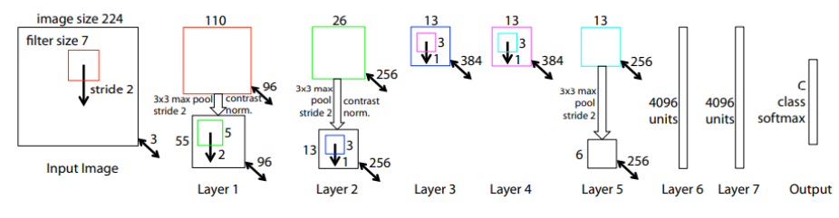

### VGG 

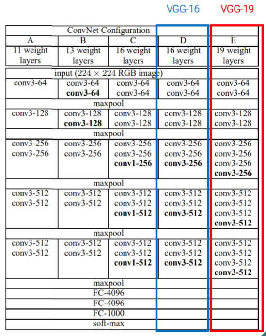

VGG rispetto a AlexNet ha introdotto il concetto di stage in cui all'interno di un singolo stage i layer hanno stesso numero di canali e W e H, i stage poi hanno un numero fisso di layer e ci sono di 3 tipi:
conv - conv - pool
conv - conv - conv - pool
conv - conv - conv - conv - pool
Alla fine di ogni stage, grazie la layer di pooling i canali vengono raddoppiati

e poi in VGG si sono usati i pesi di reti VGG piu' piccole come pesi di inizializzazione per VGG piu' grandi per creare reti un po' piu' profonde riducendo il vanish gradient ad esempio da VGG16 a VGG19(16 e' il numero di learnable layer 13 conv + 3 dense).
In particolare all'inizio si aveva VGG11, una volta trainata si aggiungo 2 layer inizializzati random e si continua il training e si crea VGG13 e cosi' via per tutte le VGG piu' profonde.
Il prof ha detto che hanni dopo che era uscita VGG lui stesso ha trainato VGG mi pare 16 e non ha dovuto fare il trick di usare VGG piu' piccole, dice molto probabilmente perche' a quell'epoca non si conoscevano tutte le tecniche per inizializzare bene una rete tipo che learning rate usare oppure normalizzare i dati.
Inoltre quasi tutti i parametri della rete sono nei layer densi finali invece il costo computazionale(flops) sta nei layer convoluzionali e l'activations memory che sarebbe la memoria richiesta per storage i features maps di output di ogni layer sta nella prima fase, nello stem layer poiche' ancora si ha una dimensione spaziale di W e H molto grande e poi grazie allo stem layer si riduce aumentando il numero di canali

### GOOGLENET, INCEPTION V1

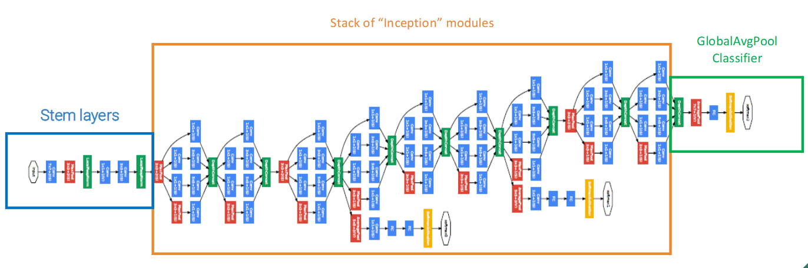

usa un trick per diminuire il vanish gradient in cui a meta' rete e a 3/4 e ovviamente alla fine mette i layer finali di classificazione (in realta' usa global average pooling che e' una novita') e poi fa un avarage dei 3 per ottenere il risultato finale Inoltre fra lo stem layer e il classificatore finale mette al centro un insieme di interception modules.

L'**Inception Module** rappresenta un cambiamento radicale rispetto alle architetture CNN tradizionali come VGG, dove i layer erano organizzati in modo puramente sequenziale (un layer dopo l'altro).
La novità principale è che in un Inception Module, l'input viene elaborato simultaneamente da diversi tipi di layer in parallelo, i cui output vengono poi concatenati e poi vengono downsampled da un layer di pooling. 
Questa struttura permette alla rete di "scegliere" quale tipo di elaborazione è più efficace per diverse caratteristiche dell'immagine.
Il motivo principale è l'efficienza computazionale. 
l'architettura permette di aumentare la profondità (riducendo il vanish gradient) e la larghezza della rete mantenendo costante il budget computazionale, in particolare l'efficienza computazionale deriva dai layer conv 1x1, che riducono il numero di canali, messi prima di layer conv costosi come 5x5 o 3x3

#### INCEPTION MODULE NAIVE 
Nella versione "naive" dell'Inception Module, l'input viene processato in parallelo da:

- Convoluzione 5x5 (32 filtri)
- Convoluzione 3x3 (128 filtri)
- Convoluzione 1x1 (64 filtri)
- Max pooling 3x3

Tutti gli output vengono poi concatenati per formare l'output finale.
Problema: Questo approccio genera un numero di canali che cresce molto rapidamente quando si impilano più moduli Inception, rendendo i calcoli computazionalmente proibitivi, specialmente per le convoluzioni 5x5 e 3x3.

##### SOLUZIONE  1x1 CONV
usi le 1x1 conv che servono a controllare il numero di canali, generalmente a comprimerlo, lasciando invariato il numero di H e W, quindi lavorano solo sui canali 
aggiungere convoluzioni 1x1 prima delle convoluzioni più grandi e dopo il max pooling per:
- Ridurre il numero di canali in ingresso alle convoluzioni più costose (5x5, 3x3)
- Controllare il numero di canali in uscita dal max pooling

Altra novita' usa un global average pooling alla fine al posto di un fully connected classifier

##### FULLY CONNECTED CLASSIFIER vs GLOBAL AVARAGE POOLING 
nel **fully connected classifier** alla fine della rete l'ultima features map viene appiattita in un vettore lungo (non tramite un particolare layer ma facendo un semplice reshape)e poi viene dato a un fully connected layer che fa la classificazione, questa operazione richiede tantissimi parametri
nel **global avarage pooling** la features maps viene data a un layer di average pooling che lavora channels wise e riduce la dimensione spaziale cosi' si riducono i parametri del layer denso di classificazione, sostanzialmente in questo caso il fully connected layer processa un riassunto di ogni features di ogni canale

### INCEPTION V3

rispetto a INCEPTION v1 presenta delle migliorie poiche' usa la fattorizzazione di cnn ad esempio una conv 7x7 la fattorizza in 1x7 seguita da 7x1 oppure una 5x5 come 3x3 seguita da 3x3 (come aveva gia' fatto VGG)

### RESNET 

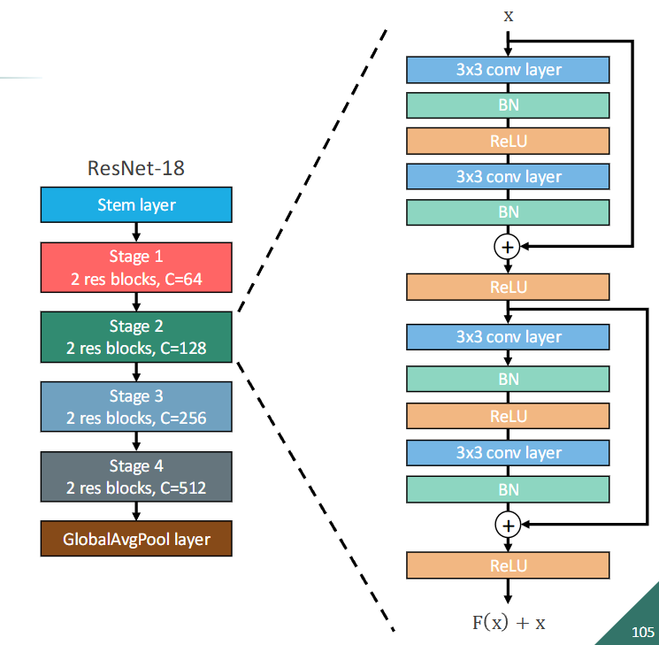

prende le cose migliori delle altre reti ad esempio gli stage da VGG e global avarage pooling da googleNet e poi sistema il vanish gradient per risolvere il vanish gradient usa gli skip connection e quindi non si ha solo f(x) ma f(x) + x ovvero l'output di uno stage e' sommato all'input dello stage, quindi prende l'x di layer precedenti, la connessione e' prima di un layer conv mette pure skip connections fra stages diversi che quindi hanno dimensione diversa, per risolvere il problema.
della dimensione usa due metodi:
- mette 2 stride nel primo layer conv all'inizio dello stage e poi fa zero pad nei canali mancanti ovvero li aggiunge mettendo tutti zero (ma sta soluzione e' poco carina perche' perdi informazione con zero pad)
- usa una 1x1 conv con stride 2 per giocare sui canali e fillare il gap della dimensione dei canali(senza usare il sistema di 
zero padding), stride 2 serve a sistemare H e W
usa STEM e global average pooling di GoogleNet, usa gli stages di VGG

Si possono trainare reti piu' profonde poiche' grazie alla skip connection la rete puo' scegliere se saltare i layer della skip e tenere solo l'identita' (x) e poi nella skip connection c'e' la batch norm che aiuta per il training.

La skip connection e' costituita da una conv 1x1 seguita da un batch norm, il tutto poi viene sommato a f(x) e viene dato in pasto a una Relu.

ResNet18 e ResNet34 usano i blocchi standard come ho parlato finora invece da ResNet50 si sono usati i Bottleneck Blocks che sono presenti dentro il blocco residuale, sostanzialmente prima e dopo conv 3x3 vengono messe conv 1x1 che riducono la dimensione dei canali e poi la rimettono normale, praticamente si aggiungono piu layer (quelli 1x1) e quindi la rete diventa piu' profonda ma i parametri diminuiscono (a causa della compressione dei canali) e quindi il costo computazionale diminuisce, avendo meno parametri la fase di training e' piu' facile

### RESNEXT

In ResNeXt, il blocco residuo è diviso in (G) rami paralleli (cardinalità), ciascuno dei quali applica una trasformazione simile ma su un sottoinsieme dei canali. Questi rami sono poi aggregati (sommati) per produrre l'output finale.
Quindi ad esempio il primo brach di layer conv vede solo i primi 3 canali
La cardinalità (G) è un iperparametro che controlla il numero di rami.
La group normalization puo' essere usata in queste architetture, ricordiamo pero' che la group normalization e' stata inventata dopo resNext quindi non e' presente nel design di questa rete

### SENet (Squeeze-and-Excitation Networks)

nei blocchi residuali viene usato uno schema squeeze and excitation in cui vi sono 3 fasi:
- **squeeze**, si usa un global average pooling che lavora channel wise e comprime ogni canale in un valore 1x1
- **excitation**, questi valori vengono passati a 2 layer fully che interpretano la rilevanza dei canali e grazie alla sigmoid viene generato un vettore di pesi 0 1 (in pratica quel canale e' rilevante si o no)
- **scale**, questi nuovi pesi vengono usati per ricalibrare i canali originale (ovvero vengono moltiplicati i canali con i suoi pesi per ad esempio attenuare quelli poco rilevanti)

In pratica, modula l'informazione in base alla rilevanza.

### MOBILENET

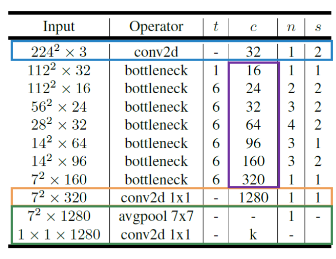

non ci sono blocchi residuali fra diversi stage, usa i bottleneck residuali invertiti ovvero invece di comprimere i canali e poi espanderli (che potrebbe portare a perdita di informazione poiche' la 3x3 conv dopo la compressione, lavora in uno spazio compresso), prima espande i canali con 1x1 conv e poi alla fine li comprime con 1x1, per non esplodere il costo computazionale la conv 3x3 presente fra 1x1 e 1x1, lavora **channel wise** ovvero applica filtri separati per ogni canale.
MobileNet e' un insieme di bottleneck residual block invertiti e relu, il numero di canali cresce lentamente rispetto ad altre reti quindi lo stem layer non deve fare una compressione iniziale brusca

### EFFICIENTNET

EfficientNet ha come baseline MobileNet e poi considera 3 parametri **width, depth e resolution**. 
Si e' visto che se si aumenta solo 1 di questi parametri non si puo' superare circa 80% di accuracy quindi bisogna aumentare tutti e 3 in compound quindi EfficientNet prende in input φ che sarebbe le tue risorse che hai a disposizione e poi le distribuisce assegnando dei valori a width, depth e resolution in base al valore di φ scelto

### NEURAL ARCHITECTURE SEARCH
sostanzialmente una net che serve a creare il design di net, praticamente hai il controller che da in output design di reti, molto costosa la fase di training perche' il controller ti sputa una rete che poi devi testare e cosi' via per ogni epoca quindi generalmente si usano poco i neural architecture search

____________________________

## TEXT RAPRESENTATION 
le parole generalmente sono rappresentante nel one hot encoding in cui hai un vettore di categorie o vocabolario (tipo un insieme di parole ad esempio {ciao, hello, pluto}) e poi se hai tipo la parola **hello**, avrai nel vettore tutti zero tranne 1 nella categoria che rappresenta **hello** poi questo vettore viene dato a un layer di embedding (generalmente un fully connected layer) che prende in input size il vocabolario e da un output di size minore (che e' l'embedding viene usato per ridurre la dimensione spaziale)

### RNN 
lavori su dati che sono di size batch x features x time(sequence).
non lavorano per forza con testo ma in generale con sequenze, il layer che poi verra' chiamato in maniera ricorsiva si chiama hidden layer 

$h_t = f (h_{t-1}, x_t, θ)$
praticamente l'output dell'hidden layer a tempo t dipende da una funzione f che puo' rappresentare uno o piu' layer lineari seguiti da una funzione di attivazione(generalmente la softmax), θ sono i pesi e bias della rete, **$h_{t-1}$** e' l'output dell'hidden layer al tempo t-1, $x_t$ e' l'input al tempo t.

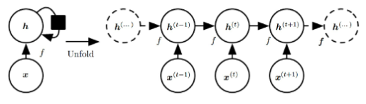

il problema e' che non ci possono essere reti RNN troppo profonde senno' arriva il problema del vanish gradient, si e' visto che con piu' di circa 10-20 token la rete fatica ad apprendere relazioni tra elementi della sequenza che sono distanti tra loro

due tipi di RNN:

- Seq2Vec (Encoder): Prende una sequenza di input variabile e la mappa a un vettore di dimensione fissa. Ad ogni passo temporale dell'encoder, riceve un elemento diverso della sequenza di input. Alla fine l'encoder sputa il vettore che e' il contesto, sarebbe la mappatura della sequenza in input nello spazio latente

- Vec2Seq (Decoder): Prende un vettore di input di dimensione fissa (il contesto) e genera una sequenza di output variabile. Il vettore di input viene principalmente utilizzato per inizializzare lo stato iniziale del decoder, che poi genera la sequenza passo dopo passo. In alcune varianti, il vettore può anche influenzare la generazione ad ogni passo.

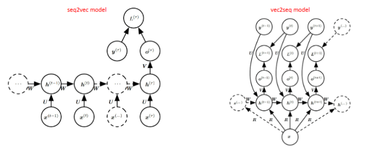

bottleneck problem: cosa succede se il contesto ha una size troppo piccola per riassumere per bene sequenze lunghe? Si usa il meccanismo dell'attenzione 

#### ATTENTION (in RNN)
Il meccanismo dell'attenzione supera il bottleneck permettendo al decoder di "dare un'occhiata" direttamente alla sequenza di input ad ogni passo della generazione dell'output, anziché affidarsi unicamente al vettore di contesto finale dell'encoder. 
Invece di avere un unico vettore di contesto globale, l'attenzione calcola un vettore di contesto specifico per ogni passo di decodifica, basato su una combinazione pesata degli stati nascosti dell'encoder creando il concetto di rilevanza (grazie all'attention score).

l'attention score e' il dot product fra hidden state dell'encoder e lo hidden state corrente del decoder, per ottenere il token in output tu prendi tutti gli attention scores, fai la softmax per normalizzarli e renderli delle probabilita' e fai una somma pesata (il peso e' la probabilita' dell'attention score con la softmax) di tutti gli hidden state 
dell'encoder e crei un vettore(viola) e il token e' dato dalla combinazione(usi o somma o concatenazione, originalmente era concatenazione) di questo vettore e l'hidden state del decoder corrente(che e' associato all'output precendete dello scorso hidden state); quindi praticamente il token in output dipende da un weighted contribution di ogni hidden state dell'encoder e poi ovviamente combinato con l'hidden state del precedente output del decoder

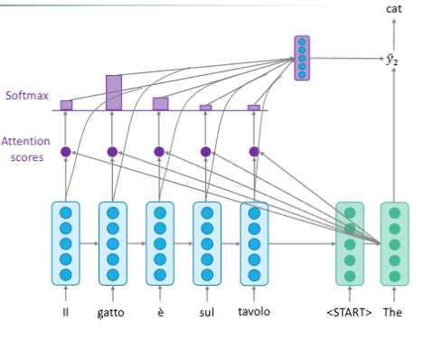

### TRANSFORMER 
le RNN non permettevano la parallelizzazione cosi' si sono inventati i transformers
iperparametri:
- $d_{model}$ 
- h (number of heads)
- N (number of layers) ad esempio N = 6 significa che usi 6 encoder uguali e 6 decoder uguali

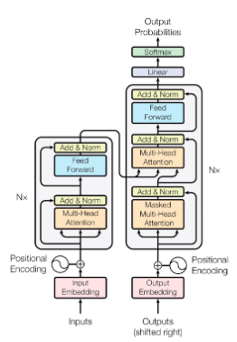

#### ENCODER 
prendi in input tutta la sentence(che e' rappresentata in one hot encoding), e la embeddi (tokenizzi e fai diventare la sentence di dimenione $d_{model}$  x 1) e poi sommi con il positional encoding(che si puo' fare in diversi modi, ad esempio frequenze di seno e coseno) che rappresenta la posizione del token nella sentence (questa info l'hai persa perche' non lavori piu' con le RNN).
L'encoder ha n layer uguali ma ognuno con pesi diversi ed ognuno di questi layer e' composto da due moduli il **multi attention head** e **feed forward**
il multi head processa tutti i token in parallelo invece il feed forward processa ogni token in maniera indipendente e espande e comprime l'input, alla fine di ogni modulo c'e' un layer normalization

#### SELF ATTENTION (ATTENTION IS ALL YOU NEED)
(diversa rispetto all'attention score di RNN) serve a trovare delle correlazioni nella sentence di input 
ogni token della sentence in input e' mappato in tre vettori:
- query vector, size Lxdk
- key vector, size Lxdk
- value vector, size Lxdk

queste operazioni vengono fatte nel multi head attention

$dk = \frac{d_{model}}{h}$

$$attention(Q, K, V) = \text{softmax}\left(\frac{QK^T}{\sqrt{d_k}}\right)V$$

$A \text{(attention matrix)} = QK^T$

hanno messo $\sqrt{d_k}$ perche' senno' il gradiente era troppo grande

l'input ha size Lxdmodel
Value ha size $dk = \frac{d_{model}}{h}$
la combinazione di Q e K ha dimensione (Lxdk) * (Lxdk) = LxL (L e' la length della sentence), poi fai la softmax e poi moltiplichi con Value e ottieni l'attention che ha size (LxL * Lxdk) = Lxdk e quindi ritorni a un ouput uguale all'input (non e' proprio uguale all'input perche' non e' Lx$d_{model}$ ma Lxdk ma poi alla fine del multihead ridiventa Lx$d_{model}$ perche' concatena tutte le varie attention) prima di passare l'attention matrix A alla softmax metti la mask (se sei nel decoder) mettendo 0 a tutte le combinazioni di token che non puoi vedere. 

L'idea e' che Q e K creano dei pesi di quanto sono correlati i token e poi questi pesi li dai a value 

#### MULTIHEAD ATTENTION
h si chiama numero di head rappresenta tipo quante rappresentazioni vuoi imparare della sentence che poi usi nel multihead e pero' Q,K e V li scali usando dk invece di dmodel senno' esploderebbero i calcoli. 

Infatti tipo se hai h=8 ti calcoli 8 attention quindi 8 Q,V,K e poi li mandi al multi head che hai un linear layer per ogni vettore e poi li concatena (per ottenere come output la stessa size dell'input Lxdmodel)

il multi head attention permette di ottenere informazioni da diverse rappresentazioni della sentence (in questo caso 8)

l'input del multi head attention e l'output (che e' la concatenazione delle varie attention) deve essere uguale senno' il residual connection non potrebbe esserci

#### FEED FORWARD 
composto da due fully connected layers, il feed forward processa in maniera indipendente ogni token della sentence(processata dal multi head attention) come singoli value e non come un vettore come fa il multi head attention.
Hai pesi condivisi nel feed forward ovvero per ogni token vengono usati gli stessi pesi nel particolare layer

#### DECODER
Ognuno dei layer riceve come input l'output precedente del decoder(quindi si dice che il decoder e' condizionato), normalmente decoder e encoder hanno 
lo stesso numero di layer (senno' ti uscirebbero dei risultati strani) quando traini gli dai tutta la sentence e pero' la maski questa e' la self attention e maski tutti i token che non hai ancora predetto (nell'encoder invece non maski nulla).
Il decoder prende l'output precedente poi lo fai diventare enbedding e lo sommi al positional encoding, poi nel masked multi head attention fai la multi head attention sull'output masked e poi c'e' multi head attention (che riceve pure l'output dell'encoder) e feed forward dopo ognuno di questi tre moduli hai il layout linear normalization
Il decoder e' autoregressive ovvero che in fase di inferenza genera il token successivo basandosi solo su quelli precedenti e non quelli futuri, non vede quelli futuri grazie al sistema delle maschere ovvero hai la sentence il gatto e' sul tavolo e la ground thruth the cat is on the table, il decoder ottiene il gatto e' sul tavolo e the(tutto il resto e' masked) e poi il gatto e' sul tavolo e the cat e cosi' via, e' autoregressivo quindi predicti un token alla volta senza vedere tutta la sentece di ground thruth senno' sarebbe cheating, l'output del decoder riva' al decoder come input togliendo il masking nella attention matrix della riga e colonna associata al nuovo input (perche' l'hai predetto)

##### CROSS ATTENTION 
Q = $L_{decoder}$ x dk
V = $L_{encoder}$ x dk
K = $L_{encoder}$ x dk

nel multi head attention del decoder, Key e Value sono prese dell'encoder e invece Q deriva dall'ultimo output del decoder.
Il decoder con la matrice Q chiede la correlazione tra quello che ha predetto con l'output dell'encoder.
La size dell'outpout del cross attention e' $L_{decoder}$ x dk poiche' Q*K = $L_{decoder}$ x dk * $L_{encoder}$ x dk = $L_{decoder}$ x $L_{encoder}$ poi si fa A * V = $L_{decoder}$ x $L_{encoder}$ * $L_{encoder}$ x dk = $L_{decoder}$ x dk 
quindi esso non dipende dalla size presa dall'encoder quindi sostanzialmente con la cross attention puoi ottenere informazione da qualsiasi architettura basta che sia qualcosa x dmodel quindi praticamente puoi collegare un encoder a una CNN in cui ogni layer della CNN e' collegato un piccolo modulo di cross attention(chiamato pure tipo mini transformer), pero' per ogni layer della CNN ci sara' un diverso modulo di cross attention perche' ogni layer ha una size diversa quindi tipo al primo layer hai CxWxH che flatti in L' e poi al secondo layer hai 2CxW/2xH/2 che flatti in L'' e lo dai a un secondo modulo di cross attention 

### VISION TRANSFORMER (ViT)
prendi un'immagine e la dividi in non overlapping patches e le embeddi in vettori della dimensione del transformer, il dmodel, e poi injecti il positional encoding(che rispetto ai normali transformer nei quali venivano usate delle funzioni di seno e coseno qui invece sono parametri learnable) a ogni patch, inoltre all'inizio della sequenza aggiungi un class token, esso e' un vettore di embedding learnable (i cui valori vengono appresi durante l'addestramento, partendo da valori casuali), della stessa dimensione d_model degli embedding delle patch. 
Non corrisponde a nessuna patch specifica dell'immagine.
Il Transformer Encoder elabora l'intera sequenza (class token + patch embeddings). L'idea è che, attraverso i meccanismi di self-attention all'interno del Transformer Encoder, questo token iniziale interagisca con tutti gli embedding delle patch e aggreghi le informazioni globali rilevanti dell'intera immagine. 
Lo stato finale di questo class token, all'uscita dell'Encoder, viene considerato come la rappresentazione vettoriale dell'intera immagine.

L'unica differenza dell'encoder nei vision trasformer e' che l'output del multi head attention prima viene mandato al layer norm e poi sommato al residual value (si e' visto che sta roba funzionava meglio per le immagini)

alla fine dell'encoder prendiamo solo l'output associato al class token che, dopo tutto il processo contiene le informazioni semantiche dell'immagine, e lo diamo in pasto a una rete semplice come una MLP (multi layers perceptrons) che mappa la rappresentazione vettoriale del class token allo spazio delle classi desiderate 
(es. "Cane", "Gatto", "Auto")

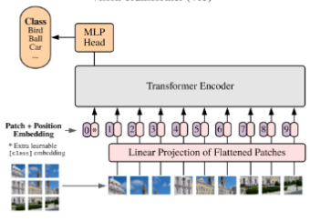

All'inizio provando questa architettura faceva schifo e hanno scoperto perche' le CNN sono invarianti alle traslazioni (se ad esempio il numero 3 e' in alto a sx dell'immagine o in basso a dx alle CNN non cambia niente, classificheranno sempre come 3) invece i transformer non sono invarianti alle traslazioni.
Per risolvere questo problema hanno trainato i ViT con miliardi di immagini in cui magari il numero 3 e' in tutte le possibili posizioni nell'immagine e quindi il modello ha imparato tutte le traslazioni, si e' visto che con grandi dataset i ViT performano molto meglio delle CNN (come e' successo nel passaggio dal machine learning al deep learning), quindi i ViT riescono a sfruttare meglio grandi dataset 

## OBJECT DETECTION 
Il task consiste nel detectare da un immagine RGB un set di oggetti, per ogni oggetto il modello dara' in output la classe di appartenenza e il bounding box
### VIOLA JONES
Algoritmo di classic vision, molto veloce infatti usato in sistemi real time, e' un algoritmo per detection di oggetti in generale ma e' stato creato per detection di face ad esempio nei telefoni per la camera
ha tre caratteristiche:
- adaboost 
- integral images 
- cascade

quando parlo di fase di training in Viola Jones non e' quella classica con stocastic gradient descent e loss poiche' e' un algoritmo di classic vision

### BOOSTING 
Definiamo come Weak classifier un classificatore ad esempio binario che e' leggermente meglio di un classificatore randomico e quindi ha una accuracy leggermente superiore al 50%.
Il bosting consiste nel trainare tot weak classifier in maniera sequenziale uno dopo l'altro, una volta trainato un weak classifier si analizzano gli esempi in cui ha sbagliato e il prossimo weak classifier si concentrera' su correggere questi errori.
Un Strong classifier sarebbe una somma pesata dei weak classifier addrestrati.
Generalmente il peso associato a un weak classifier e' basato sulla sua accuracy ottenuta.
La previsione di uno Strong Classifier e' la somma pesata delle previsioni dei weak classifier 

### ADABOOST 
nel contesto di Viola Jones i weak classifier sono dei filtri rettangolari di lunghezza fissa (24x24) che ritornano 1 o -1 in base se e' presente un volto in quei pixel dell'immagine.

Praticamente per ogni feature viene creata una patch che contiene una zona bianca e una nera come in foto, oppure magari diviso 4 quindi 2 zone bianche e 2 nere, considerando il caso binario viene considerata prima la patch col bianco a sx e poi quella col bianco a dx quindi tutte le combinazioni (quindi i weak classifier sono veramente tanti). Le zone bianche hanno peso associato +1 e le zone nere hanno peso -1, fai la somma pesata di tutti i pixel presenti nella patch e poi se la somma e' maggiore di una soglia allora il weak classifier ritorna 1 (c'e' un volto) senno' ritorna -1.

Il problema e' che i possibili weak classifier sono tantissimi e cosi' all'inizio della fase di training vengono considerati tantissimi weak classifier e poi pero' adaBoost in fase di training iterazione dopo iterazione seleziona i weak classifier che hanno avuto performance migliori fino ad arrivare a 200 weak classifier scelti da adaboost che poi combinati assieme formano lo strong classifier, per velocizzare i calcoli dei weak classifier si usano le integral images.
Sostanzialmente in fase di training ad ogni iterazione, adaboost seleziona il weak classifier con errore pesato più basso e lo aggiunge al modello.
A fine training, ottieni uno strong classifier formato dalla combinazione dei primi 200 weak classifier.
A runtime poi nell'algoritmo passi una patch 24x24 al detector e gli applichi tutti e 200 i weak classifier, se almeno uno restituisce "no volto" (-1) allora la patch viene immediatamente scartata(questo e' la cascade)

### INTEGRAL IMAGES 
praticamente e' una matrice in cui il valore (i,j)  è la somma di tutti i pixel nell'immagine originale I che si trovano nel rettangolo che va dall'angolo in alto a sinistra (0,0) fino alla posizione (i,j) inclusa. 
In realta' per calcolare il valore (i,j) della integral images non devi sommare tutti i valori precedenti dell'immagine originale ma basta fare la somma di (i,j-1) + (i-1,j) - (i-1,j-1) della integral images sommato al valore di (i,j) nell'immagine originale 

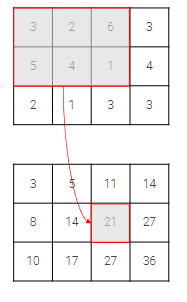

In questo caso il valore 21 e' stato calcolato come 14 + 11 - 5 (presi dalla integral image) + 1 (pixel corrente nella matrice originale)

Il problema delle integral images e' che con immagini grandi i numeri diventano enormi e si va in overflow

#### uso delle  integral images per adaboost 

Nel pratico come vengono usate le integral images, facciamo finta che abbiamo questa integral image divisa in due regioni A e B dove A corrisponde alla zona bianca e B zona nera (ricordati il fatto dei weak classifier), per calcolare la somma pesata dei pixel, basta che invece prendi l'integral images legata a quella patch e poi invece di fare la somma pesata calcoli:
corner destro di A - corner destro di B 
ricordiamo che B ha peso -1 (perche' e' zona nera) per questo facciamo questa differenza. 
I vari corner sono dell'integral Image.

torniamo a Viole Jones, come abbiamo detto si usano patch di dimensione fissa 24x24, in realta' pero' un volto puo' essere piu' grande e quindi si usano pure patch piu' grandi tipo 30x30 e cosi via, tanto hai le integral images che velocizzano i calcoli, problema comunque hai tantissime patch da considerare e quindi e' difficile che rimane real time il sistema

### CASCADE 

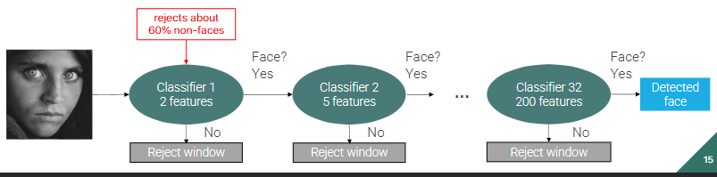

si e' visto che in una immagine pochi pixel sono volti, generalmente e' quasi tutto sfondo quindi ci saranno tante patches che sono sfondo e non ha senso per quelle calcolare tutti e 200 i weak classifier, si spreca computazione, quindi per ogni patch prima si usano 2 weak classifier e se la patch viene detectata faccia allora passa e va allo stadio 2 in cui si usano 5 weak classifier cosi' via fino a 200 e poi detected face

### INTERSECTION OVER UNION  IoU
per capire di quanto due bounding box overlappano si fa:
$IoU = \frac{Intersezione}{Unione}$

#### TESTING VIOLE JONES 
In fase di testing avremo tantissime bounding box dopo la fase di cascade e noi ovviamente vogliamo invece una singola box per faccia (nell'immagine ci possono essere piu' facce) e per ognuna delle box ci sara' associato uno score che sarebbe quanto il detector e' confidente del risultato, spesso tante box sono ridondanti che rappresentano la stessa faccia, quindi quello che fai e' la Non Maxima suppression delle box ovvero:
1) scegli la box con lo score piu' alto chiamiamola S e la metti nella lista finale
2) elimini tutte le box dello stesso volto che hanno IoU > soglia (quelle ridondanti) confrontandole ovviamente con la box selezionata
3) ripeti dal punto 1 con le box rimaste dopo il filtraggio (ovviamente non puoi riselezionare la box S)

ad esempio noi abbiamo una foto con Alice e Bob e 9 box uscite dalla cascade, 5 associate ad Alice (A1, A2, A3, A4, A5) e 4 associate a Bob  (B1, B2, B3, B4), ipotiziamo che A1 abbia lo score piu' alto e quindi viene selezionato e viene messo nella lista "risultati_finali", i box A2, A3, A4, A5 sono molto sovrapposti ad A1 e quindi NMS li sopprime, alla seconda iterazione viene considerato B1 che fra i box rimanenti (B1, B2, B3, B4) e' quello con lo score piu' alto, B1 viene messo in "risultati_finali", con NMS vengono soppressi (B2, B3, B4), non avendo piu' box rimasti finisce l'algoritmo con risultati_finali = (A1, B1).

Per valutare il detector confronti ogni predizione con le ground truth:
- se una box ha IoU > threshold allora e' un True Positive (TP)
- IoU < treeshold allora False Positive (FP)

_______________________________________________________________________________________

#### TRANSFER LEARNING
prendi una rete pretrainata e o lasci i pesi uguali di tutti i layer e traini solo il classificatore oppure continui il training pure degli altri layer, generalmente nel fine tuning viene usato un learning rate molto basso per non sminchiare troppo i pesi della rete pretrainata

## OBJECT DETECTION in DEEP LEARNING 
se abbiamo solo un oggetto da detectare nell'immagine allora e' facile perche' diventa un problema di object localizzation ovvero identificare le posizioni dell'unico box nell'immagine e la classe di appartenza quindi prendi una rete gia' addrestrata e togli il classificatore e metti due Fully connected layer in parallelo di cui uno predice le 4 info del box (width, height e x e y del centro del box) e l'altro predice la classe.
Ci sono due loss, una di classificazione (classificare la classe) e una di regressione (capire la posizione del box)

#### DETECTION di MULTI OBJECTS
in questo caso non sappiamo a priori quanti oggetti ha l'immagine quindi un'idea sarebbe usare una CNN con una sliding window per detectare le bounding box degli oggetti aggiungendo una classe per il background, pero' ci sarebbero troppe windows da considerare quindi si usa il metodo delle region proposals(regioni in cui e' piu' probabile che ci sia un oggetto), algoritmi come Selective Search che all'inizio nell'immagine vengono identificate delle piccole regioni e quindi l'immagine risulta molto frammentata e poi via via a ogni iterazione vengono aggregate regioni vicine in base a colore, texture e altre caratteristiche finche alla fine del processo si avra' solo un'unica regione e l'algoritmo si ferma non potendo piu' aggregare.
E' importante notare che le region proposals e' l'insieme di tutte le regioni proposte a ogni iterazione (non solamente dell'ultima iterazione che in realta' ha poco significato)

### R-CNN (region based CNN)

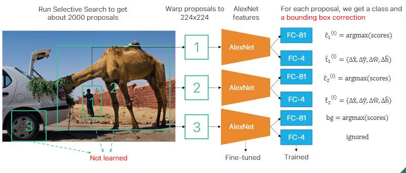

si usa Selective Search per ottenere circa 2000 proposte e poi per ogni proposta viene prima warpata (viene ingrandita la regione di spazio della proposta, si e' visto che cosi' le CNN estraggono piu' features se l'immagine in input e' piu' grande) e si warpa pure per matchare l'input size di AlexNet ovviamente poi viene mandata ad AlexNet fine tunato cambiando l'ultimo layer di classificazione con due layer FC in parallelo come dicevo prima che uno precide la classe e l'altro le info della box.
Il problema e' che le proposte di selective Search non sono dei parametri learnable, per risolvere il problema la network raffina le proposte della selective Search facendo una box correction (in fase di training la network impara a fare la box correction confrontando la box della proposta con quella della box della ground truth che overlappa di piu' e cercando di imparare a diminuire questa differenza)

problema di R-CNN: e' lenta

### FAST R-CNN 

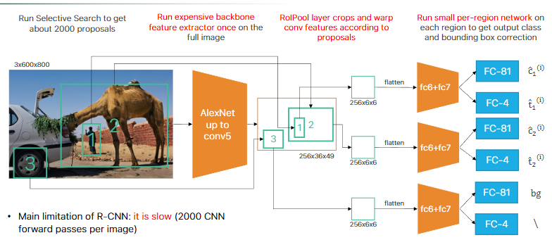

prima la cosa che era lenta e' che per ogni proposta devi in input ad AlexNet una regione e poi la processavi e andavi a quella dopo quindi AlexNet doveva processare 2000 proposte ora invece intanto invece di usare tutto alexNet viene usato fino alla conv5 ma poi tu a conv5 invece di dargli ogni volta una proposta diversa gli dai solo una volta l'intera immagine e poi l'output di conv5 e' una feature map.
Le coordinate delle proposte vengono mappate nella feature map(poiche' normalmente la feature map ha dimensioni ridotte rispetto all'immagine originale) ovvero nelle RoI (region of Interest) e poi per ogni RoI viene fatto un max pooling per arrivare alle piccole dimensioni fisse che poi vengono date a FC6 poi c'e' FC7 e poi i classici due classificatori per le info del box e le classi questo metodo viene chiamato RoI Pooling ed e' la principale novita' di FAST R-CNN 

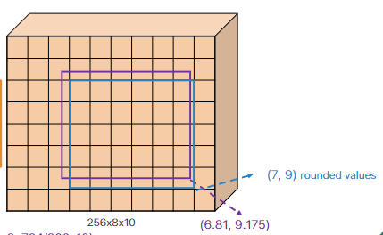

il problema rimane comunque che le proposte non sono learnable e che la selective search ci mette 2 secondi quindi puoi ottimizzare e velocizzare quanto vuoi quello dopo ma comunque come minimo ci metti 2 secondi che e' troppo per un uso real time 

### FASTER R-CNN

si toglie selective search e' le proposte vengono generate da una mini rete chiamata RPN (region proposal Network) il cui input viene dall'output di conv5 di AlexNet quindi RPN prende in input la features map poi ha una window piccola 3x3 e la fa scorrere nella feature map, il problema iniziale e' che a RPN stiamo chiedendo troppo, chiediamo di darci la posizione dei bounding box, la giusta scale o aspect ratio e cosi' aggiungiamo degli anchors ovvero ad ogni posizione della finestra vengono considerati delle box anchor a diverse scale e a diverse aspect ratio (tipo rettangolo, quadrato, rettangolo con un lato piu' lungo) tutte centrate al centro della window(ovviamente di dimensioni minori rispetto all'intera windows), il numero di anchor e' fisso ad esempio k=9, per ogni anchor il RPN predice un objectness score che sarebbe quanto quell'anchor individua un oggetto o il background
per ottenere le proposte finali: 
- Si prendono gli anchor box che hanno ottenuto un "objectness score" elevato (sopra una certa soglia).
- Si applicano le correzioni(le box correction) a questi anchor box per ottenere le coordinate finali delle proposte di regione.
- Spesso si applica anche qui una forma di Non-Max Suppression per ridurre il numero di proposte sovrapposte.

#### FASE DI TRAINING RPN 
etichettiamo anchor positivi quelli che hanno IoU > 0.7 con un box ground truth di un oggetto, anchor negativi il contrario, per creare il minibatch prendiamo tutti gli anchor positivi di un oggetto e poi i rimanenti posti tutti anchor negativi, facciamo la anchor correction (basandoci sul box ground truth corrispondente) solo per gli anchor positivi, gli anchor negativi li sortiamo in base all'objectness e filtriamo via quelli che hanno l'objectness basso quindi teniamo solo gli hard negatives (ovvero anchor non positivi che pero' e' piu' difficile da dire che non sono quell'oggetto, teniamo questi perche' cosi' la net impara meglio)

#### LIMITAZIONI FASTER C-NN  
Faster C-NN, in particolare RPN lavora sulla feature map che e' piu' piccola rispetto all'immagine originale, e' piu' semantica quindi e' meglio per detectare oggetti pero' potrebbe non detectare oggetti che sono gia' piccoli nell'immagine originale

#### MULTI SCALE 

per risolvere questa limitazione di FASTER C-NN si considerano diverse scale come abbiamo fatto in DoG in particolare consideriamo 3 scale a tre depth diverse della rete quindi con 3 feature maps diverse che poi vengono date in pasto a 3 RPN che producono bad proposal (feature map a inizio rete), average proposal e good proposal (il vecchio singolo output della rete senza il multi scale), ovviamente la feature map a inizio rete non essendo stata processata e' una bad proposal, per farle diventare tutte good proposal si usa FPN, ovviamente multi scale e anche FPN rendono la rete piu' lenta ma piu' precisa e infatti per risolvere un po' sto problema per ogni scale quindi per ogni feature map vengono considerati meno anchor

### FPN (FEATURE PYRAMID NET)

invece di dare direttamente le varie feature map a RPN con FPN vengono processate sommandole pure con le feature map piu' profonde nella rete per ottenere semantica e avere quindi solo good proposal 

abbiamo le 3 feature map, iniziale, media, finale, i 3 output sono:
- la feature map finale viene data a RPN ed e' una good proposal 
- inoltre sempre la finale (come si vede nell'immagine in basso) gli viene fatto un upsampling per fixare la risoluzione e viene sommata alla feature maps media alla quale e' stata fatta una conv1D per fixare i canali e poi la risultante viene data a una conv3d(si e' visto che 
dopo un upsampling conviene una conv3d per smoothare il risultato) ed esso viene dato a RPN formando una good proposal

sostanzialmente tranne la finale che ha gia' il giusto numero di canali, le altre feature maps si processano all'inizio con conv1d poi si sommano con tutte le feature avanti (tipo iniziale viene sommata sia con media che finale) che pero' quelle avanti sono state upsamplate per fixare la risoluzione e poi prima di dare in pasto il tutto a RPN si usa conv3d per smoothare

### ONE STAGE VS TWO STAGES 

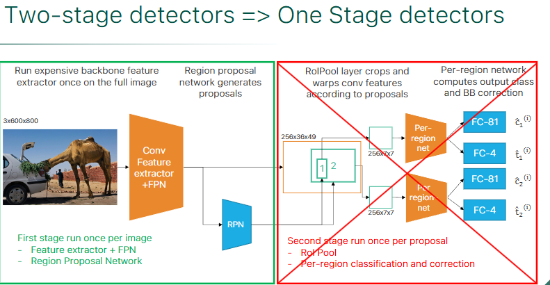

il problema delle varie reti considerate tipo FASTER CNN e' che hanno una prima stage che va una sola volta (fino a quando vengono generate le proposte) e poi una seconda parte la two stage che gira per ogni proposal (e sta cosa che gira per ogni proposta non va bene perche' si perde molto tempo e non rende il sistema real time) e come se nella 2 stage ci fosse un for loop per ogni proposal e quindi si e' cercato di trasformare il tutto in una sola stage che gira solo una volta

Two Stages:
Lo Stadio 1 (la RPN): Prende le feature map e, per ogni anchor, produce:
- Un punteggio di oggettività (objectness score): Indica la probabilità che quell'anchor contenga un qualsiasi oggetto (vs sfondo).

Lo Stadio 2 (Detector Head): Prende le proposte filtrate dallo Stadio 1 e, per ciascuna proposta, produce:
- Le probabilità per le classi finali (C classi + sfondo).
- Una correzione finale del bounding box.

Idea Generale One Stage:
Il detector ti continua a dare l'objectness score che puo' servire per sortare i risultati e fare NMS pero' da pure le correzioni degli anchor e anche le classi degli anchor e poi l'output puo' essere visto come un unico tensore che contiene tutte queste informazioni

### SSD Single shoot Multibox detector 

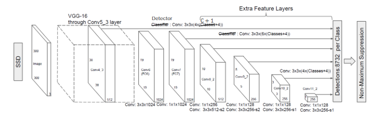

Vengono usati piccoli rilevatori (convoluzioni 3x3) applicati a diverse feature maps estratte a vari livelli della rete principale ovvero VGG, ogni rilevatore e' responsabile per rilevare oggetti a quella particolare scala/risoluzione, l'output di ogni rilevatore contiene le probabilita' delle classi e le correzioni per i bounding box, le rilevazioni con bassa confidenza vengono scartate

### YOLO v3

in yolo v2 sono stati introdotti i learned anchors (non fissi anchor come in faster R-CNN) e poi in yolo v3 ha introdotto una specie di FPN con il classico conv 3x3 dopo un upsampling, yolo v3 e' basato come backbone su Dark-net (rispetto a SSD che usava VGG).
La sua strategia multi-scala è simile a quella di FPN (Feature Pyramid Network): combina feature map da livelli diversi sempre con lo stesso principio uguale di FPN con i vari upsampling e conv3x3. 
Tuttavia, invece di sommare le feature (come fa FPN), YOLOv3 le concatena (piu' veloce e si e' visto che aveva performance uguali a sommare).
I learned anchor funzionano che invece tu programmatore staticamente dire la dimensione degli anchor, essi vengono appresi da un dataset, si usa l'algoritmo k-means clustering su un dataset per apprendere la forma dei bounding box di ground truth e poi quindi generare anchor piu' vicini possibili a una buona soluzione

### RETINANET 

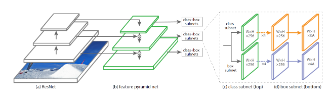

ha come backbone Resnet e poi usa sempre uno stile FPN con conv3x3 ma le teste di classificazione(classificare le classi) e di regressione (dire dove sono i bounding box) hanno pesi non condivisi perche' devono risolvere task che richiedono rappresentazioni delle feature diverse pero' la principale innovazione e' la Focal Loss ma ci arriviamo 

#### CLASS IMBALANCE 
Il task dell'object detection spesso ha un class imbalance nei dati, ovvero se da un'immagine devi classificare una penna su un tavolo ci saranno magari pochi box positivi relativi alla penna e tanti box easy negative ad esempio di un libro sul tavolo e se si traina un modello, nel batch quindi ci sarao tanti easy negative e quindi il modello impara poco.
I modelli a 2 stages risolvevano questo problema perche' nel batch di training sortavano i box negativi in base all'objectness score e quindi mettevano come primi i hard negative, invece in 1 stage se metti nel batch randomicamente dei sample negativi quasi sicuramente saranno tutti easy negative e cosi' RetinaNet per risolvere questo problema modifica la loss

consideriamo una Binary Cross Entropy oggetto vs sfondo 
dove p e' la probabilita' assegnata dal modello che l'anchor appartenga all'oggetto

$$p_t = \begin{cases} p & \text{if } y = 1 \quad \text{é oggetto}\\ 1 - p & \text{otherwise} \quad \text{é sfondo} \end{cases}$$

$$BCE(p_t) = -\ln(p_t)$$
quindi $p_t$ rappresenta la probabilita' che il modello faccia corretto e assegni la classe della ground truth, quindi se la ground truth e' l'oggetto allora la probabilita' corretta per l'anchor e' p, se la ground truth e' sfondo, allora la probabilita' corretta e' 1-p

#### EASY NEGATIVE e HARD NEGATIVE
gli easy negative sono anchor che corrispondono a sfondo ($y \neq 1$) e che il modello classifica come sfondo con alta confidenza ovvero p (predizione che e' oggetto) e' molto bassa e quindi $p_t$ e' molto alta.
Invece gli hard negative hanno pt molto bassa

Il problema della binary cross entropy e' che il contributo della loss per gli esempi classificati corretti (p>0.5) e' bassa (perche' e' il log di $p_t$ come si puo' vedere nella foto successiva) ma non trascurabile e siccome ci sono tanti easy negative allora la somma dei loro contributi sovrasta gli hard negative e quindi il modello impara a classificare meglio gli easy negative e quindi il training non e' ottimale (magari passa un easy negative da 0.8 a 0.9 ma a noi ci interessano di piu' gli hard negative)

#### BINARY FOCAL LOSS 

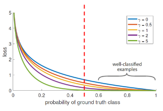

$$BFL(p_t) = -(1-p_t)^γ \ln(p_t) $$
dove γ e' un iperparametro, generalmente 2

come funziona: 
- se un esempio e' classificato male($p_t$ e' piccolo) allora $1-p_t$ e' vicino a 1 e quindi la Focal Loss e' simile alla Cross Entropy 
- se un esempio e' classificato bene($p_t$ vicino a 1) allora $1-p_t$ e' vicino a zero e grazie a γ diventa ancora piu' vicino a zero e quindi la loss diventa bassissima 

esempio: 
con γ = 2 e $p_t = 0.9$ (easy negative) la loss viene ridotta di 100 volte rispetto alla BCE

#### WEIGHTED BINARY FOCAL LOSS 
$$WBFL(p_t) = -α_t(1-p_t)^γ \ln(p_t)$$

$$α_t = \begin{cases} α & \text{if } y = 1 \\ 1 - α & \text{otherwise}  \end{cases}$$

α serve in dataset sbilanciati per bilanciare il contributo nella loss per la classe positiva (α) e per la classe negativa (1-α) e quindi garantisce che gli errori sulla classe rara (spesso quella positiva) non vengano ignorati solo perché sono meno frequenti. 

Invece la focal loss bilancia l'importanza tra sample facili e difficili all'interno di ciascuna classe (principalmente riducendo il peso degli esempi negativi facili) e quindi a guidare il training verso gli hard negative

##### MULTI LABEL vs MULTI CLASS 
Nei detector One Stage il task viene trattato come un problema multi label e non multi class 
- Multi class: si assume che un box appartenga a una sola classe e quindi si usa alla fine una softmax che normalizza gli output in modo che sommino 1, forzando una singola classe vincente 
- Multi Label: permette un box di appartenere a zero, una o piu' classi contemporaneamente(e' utile se nel box piu' classi si sovrappongono) e si usa la sigmoid invece della softmax

### LOSS FINALE RETINANET 

##### LOSS di Classificazione

$$L_{cls}(s^{(i,j)}, y^{(i,j)}) = \sum_{k=1}^{C} \text{WBFL} \left( \sigma \left( s_k^{(i,j)} \right) \right)$$

dove:
- C sono le classi
- $s_k^{(i,j)}$ sarebbe la predizione per l'anchor j associato alla classe k, all'immagine i
- $y^{(i,j)}$ e' la ground truth ed e' 1 se l'anchor j dell'immagine i appartiene veramente alla classe c altrimenti 0

non si usa la classe di background e invece viene considerato background se tutte le probabilita' delle classi sono sotto un certo threshold

##### LOSS di REGRESSIONE
si usa una SmoothL1 loss calcolata fra gli anchor e le ground truth, inoltre essa viene calcolata solo per le anchor box a cui è stata assegnata una ground-truth box (cioè, che contengono un oggetto)

La loss finale e' la somma pesata delle due loss 
$$L = L_{classificazione} + λ L_{regressione}$$
λ serve a bilanciare i due termini e spesso e' uguale a 1

#### LIMITE DEGLI ANCHOR 
- Anchors e' un modo brute force per risolvere il task di detection, fra tutti i box scegliamo un subset che pero' non e' chiaro il modo
migliore per scegliere questo subset 
- otteniamo tanti duplicati che poi dobbiamo levare con NMS
- in fase di training dire se un anchor e' giusto (e' simile alla ground truth) e' basato su threshold e tecniche empiriche 

### CENTERNET 

fa la detection non tramite gli anchor ma tramite i keypoint(tipo DoG), sostanzialmente un keypoint e' il centro di un oggetto e la rete impara a predirre la posizione dei keypoint, la rete produce heatmap Y per ogni classe di valori compresi fra 0 e 1, $Y_{xyc}$ (con size $\frac{H}{R}$x$\frac{W}{R}$x$1$ con R stride) vicino a 1 indica che nelle coordinate (x,y) di questa heatmap si ha un keypoint per la classe c.
Le heatmap ovviamente hanno dimensione ridotta rispetto all'immagine e per fare questo downsampling si usa lo stride pero' questo puo' far diventare meno precisa la heatmap.
La rete predice pure queste cose anche se servono solo per i keypoint:
- Un offset locale che serve a correggere l'errore introdotto dallo stride per ritrovare la poszione esatta del centro dell'oggetto
- la size del bounding box con centro il keypoint

#### INFERENCE TIME 
La rete crea una heatmap per ogni classe tipo (casa, macchina).
Una volta che la rete ha prodotto le heatmap, i vari offset locali e bounding box come viene presentato l'output?
per ogni classe c si prende la corrispondente heatmap e si cercano i massimi locali per trovare il keypoint, una volta trovato viene usato l'offset per trovare l'effettivo centro dell'oggetto e poi viene associato il bounding box raffinato

##### GROUND TRUTH 
Come si fa a creare la ground truth? noi abbiamo un oggetto in un'immagine e sappiamo il suo centro, quello che dobbiamo fare e' projectare il centro nello spazio della heatmap che e' a piu' bassa risoluzione e si fa dividendo le coordinate del centro per lo stride (e poi in teoria in training il modello grazie all'offset dovrebbe fare il processo inverso di questa projezione), una volta ottenute le coordinate del nuovo centro dobbiamo assegnare valori alla heatmap risultante, invece di mettere semplicemente 1 al 
centro e 0 al resto (approccio duro) CenterNet usa un approccio piu' smooth usa una distribuzione gaussiana per creare i valori con centro in p e poi valori positivi decrescenti man mano che ci si allontana dal centro.
L'approccio smooth rende il target meno sensibile a piccole imprecisioni

##### FLEXIBLE DESIGN 
Si e' visto che l'approccio a keypoint di CenterNet e' molto generalizzato, se hai dataset con ground truth che rappresentano altre cose tipo le articolazioni del corpo umano, CenterNet riesce a detectarle

## SEGMENTAZIONE
ogni pixel viene fatto appartenere a una classe (un oggetto) e nella maschera di segmentazione ogni classe ha un colore diverso, c'e' un dataset cityscapes dataset che e' segmentazioni di immagini stradali, si voleva trainare un modello per guida autonoma, il problema e' che questo dataset e' troppo piccolo, cosi' hanno usato il motore grafico di GTA 5 per generare dati sintetici e trainare il modello ma una volta provato nel mondo reale faceva schifo (Domain shift problem) perche' il dominio e' molto diverso, e' come le macchine tesla a guida autonoma trainate solo su dati di strade americane una volta portata la guida autonoma in europa facevano schifo, parlando del modello iniziale quindi hanno trainato il modello con i dati sintetici e poi fine tunato con cityscape ottenendo degli ottimi risultati

### METRICHE 

#### IoU GENERALIZZATA 
$$IoU_c = \frac{intersezione_c}{unione_c}$$ 
l'intersection over union di una classe si calcola in questo modo, dove ad esempio l'intersezione e' il numero di pixel presenti per una determinata classe sia nella ground truth che nell'output del tuo modello 

#### MIoU
$$mIoU (\text{Mean IoU}) = \frac{IoU_{c1} + IoU_{c2} ...}{\text{numero di classi}}$$

#### PIXEL ACCURACY 

$$\text{pixel accuracy} = \frac {\sum_c TP_c}{\text{numero dei pixel del dataset}}$$  

e' un po biased perche' se predici bene oggetti grandi con quindi tanti pixel, allora avrai un'accuracy molto alta ma magari gli oggetti piu' importanti e critici sono gli oggetti piccoli che il modello pero' non e' detto che avendo la pixel accuracy alta allora li predica bene, ad esempio il modello predice bene il background ma non l'oggetto, ha pixel accuracy alta ma non ti serve a niente

#### MEAN ACCURACY
fa la media delle accuracy di ogni classe, da ugual peso a ogni classe 

$$accuracy_c = \frac{TP_c}{\text{somma dei pixel di c nel dataset}}$$

$$\text{mean accuracy} = \frac {\sum_c accuracy_c}{\text{numero delle classi}}$$

#### FREQUENCY WEIGHTED IoU 
l'idea e' simile a mean accuracy ma invece di dare stesso peso a ogni classe, il peso e' basato sulla sua frequenza (numero di pixel) nel dataset 

$$frequency_c = \frac{\text{numero pixel di c nel dataset}}{\text{ numero pixel nel dataset}}$$ 

$$\text{frequency weighted} = \sum_c (frequency_c * IoU_c)$$ 

### SLOW R-CNN For Segmentation 

primo approccio a risolvere la segmentazione fallendo abbastanza miseramente poiche' era estremamente lento praticamente su ogni pixel prendi il pixel e una sua piccola regione intorno e lo passi a una backbone e poi a un classificatore, e' estremamente lento dovendo praticamente processare la rete per ogni pixel 

### FULLY CONVOLUTIONAL NETWORK 

prendi l'immagine, la fai processare da una backbone e ottieni una features map che ha piu' canali e risoluzione ridotta e come fai a ottenere un output di segmentazione con le varie maschere che sarebbe come numero di canali il numero di classi da predirre e risoluzione tornare a quella dell'immagine? 
per fixare e ridurre il numero di canali usi una conv1D e per aumentare la risoluzione usi l'upsampling

ci sono due modi base:
- Nearest Neighbor in cui copi il valore del pixel nei sui vicini
$
\begin{bmatrix}
1 & 2 \\
5 & 3 \\
\end{bmatrix}
$ -> $
\begin{bmatrix}
1 & 1 & 2 & 2\\
1 & 1 & 2 & 2\\
5 & 5 & 3 & 3\\
5 & 5 & 3 & 3\\
\end{bmatrix}
$

- Bilinear interpolation in cui fai una bilinear interpolation
$
\begin{bmatrix}
1 & 2 \\
3 & 4 \\
\end{bmatrix}
$ -> $
\begin{bmatrix}
1 & 1.25 & 1.75 & 2\\
1.5 & 1.75 & 2.25 & 2.5\\
2.5 & 2.75 & 3.25 & 3.5\\
3 & 3.25 & 3.75 & 4\\
\end{bmatrix}
$

bisogna stare attenti con la bilinear interpolation intanto perche' puo' creare artefatti ma poi non la puoi usare con classi discrete (poiche' se vedi crea valori intermedi tipo 1.25) quindi tipo la ground truth sempre e' a classi discrete ovvero tipo 1 per la classe tiroide e 0 per background e quindi non puoi fare la bilinear sulla ground truth senno' i valori intermedi non sapresti a che classe individuarli, quello che puoi e' dopo la bilinear un round all'integer piu' vicino

### FULLY CONVOLUTIONAL NETWORK 32s, FCN 32 stride

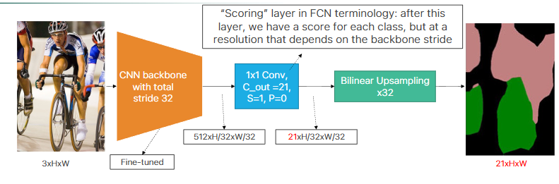

si chiama fully convolution network perche' ha solo layer convoluzionali e non layer densi. 
Prendi l'immagine e gliela mandi a una backbone con uno stride totale 32 e poi la feature map fai conv1D per fixare il numero di canali e ottieni uno score ovvero per ogni posizione spaziale nella mappa (H/32)x(W/32) e per ciascuna delle 21 classi, lo score rappresenta la "fiducia" o l'"evidenza" accumulata dalla rete che quella regione appartenga a quella specifica classe.
Poi fai la bilinear interpolation per fare l'upsampling.
Il problema di FCN 32s e' che fai uno stride alto 32 e quindi il risultato e' grossolano.
Soluzione: concateni score a diversa risoluzione come con FPN

### FCN 16s

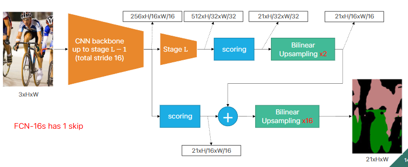

prendi lo score a stage L-1 con stride 16 e concateni questo score con quello a stage L stessa cosa per FCN 8s ma concateni 3 score 

### TRANSPOSED CONVOLUTION 
per ogni pixel in input gli sovrapponi il kernel come fai nella conv classica e poi moltipli il pixel per le celle del kernel che rientrano nello spazio dell'output se alcune celle si sovrappongono con vecchi valori di altre computazioni fatte da altri pixel allora si sommano.
esempio con padding 0 e stride 2 (si ha upsampling solo con stride > 1)

$
\begin{array}{c c}
\text{input} & \\
\begin{bmatrix}
1 & 2 & 3 \\
4 & 5 & 6 \\
7 & 8 & 9
\end{bmatrix}
\end{array}
$$
\begin{array}{c c}
\text{kernel} & \\
\begin{bmatrix}
1 & 1 & 1 \\
1 & 1 & 1 \\
1 & 1 & 1
\end{bmatrix}
\end{array}
$$
\begin{array}{c c}
\text{output I iterazione} & \\
\begin{bmatrix}
1 & 1 & & &  \\
1 & 1 & & & \\
 &  & & &
\end{bmatrix}
\end{array}
$$
\begin{array}{c c}
\text{output II iterazione} & \\
\begin{bmatrix} 
1 & 1 + (2*1) & 2 & 2 &\\
1 & 1 + (2*1) & 2 & 2 &\\
 &  & & &
\end{bmatrix}
\end{array}
$

**prima iterazione**
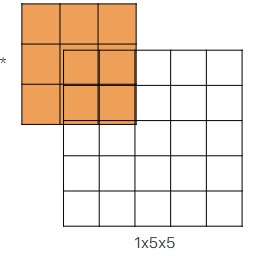

**seconda iterazione**

             

Nelle transposed convolution ci sono delle zone che sono usate di piu'(quelle in cui si sommano i valori), esse creano il **checkerboard effects** che per task di detection non creano problemi ma per task di generazione invece crea problemi il checkerboard effect e quindi non usiamo transposed convolution e invece usiamo upsampling e conv3x3

#### CHECKERBOARD EFFECT 
nelle transposed conv (chiamate pure upconv o fractional stride conv) ci sono delle zone (spesso quelle centrali rispetto alla proiezione del kernel) che ricevono più "attenzione" (cioè, più termini della somma convoluzionale, fanno piu' somme) rispetto ad altre (spesso quelle ai bordi della proiezione).
Questo crea un pattern a scacchiera di intensita' di colori, questi artefatti sono problematici in task generativi perche' sono molto visibili nel risultato, invece in ad esempio una detection non ci crea troppi problemi alla fine per detectare l'oggetto 

#### UPSAMPLING 
- transposed conv, kernel learnable
- metodi semplici: Nearest Neighbor e Bilinear interpolation,   kernel fissi

### U NET 

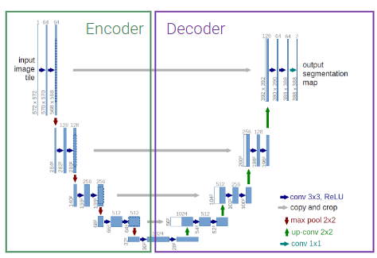

la prima architettura presentata a una medical conference e non a una computer vision conference, architettura encoder-decoder con la stessa depth.
Ci sono 3 operazioni fatte in U net principali:
- conv3x3
- downsampling fatto col max pooling
- upsampling con upconv 
- skip connections fra encoder e decoder a stessa depth 

l'encoder comprime assai l'immagine e ogni volta che fai il downsampling raddoppi il numero di canali fino ad arrivare al latence space e poi il decoder fa l'up sampling con le transposed conv e poi ci sono pure skip connections fra l'encoder e il decoder a ogni depth, l'operazione della skip connection e' la concatenazione siccome pero' le dimensioni della feature map di encoder e decoder alla stessa depth e' diversa, il decoder ha H e W piu' piccola allora prendiamo solo il centro della feature map dell'encoder (per arrivare alla dimensione del decoder) e poi concateniamo col decoder, tipo se encoder e' 5x5 (H e W) e decoder e' 3x3 dell'encoder prendiamo solo il centro 3x3

#### DILATED CONVOLUTION 
nel kernel metti degli 0 in base a r e poi fai una semplice convoluzione, si chiama dilated perche' metti 0 fra i pesi del kernel quindi diluisci diciamo le parti importanti del kernel, si usano le dilated conv per aumentare il receptive field

### DEEPLAB 
usa ResNet con dilated conv, l'idea e' che la normale ResNet usa layer di downsampling (stride e max pooling) per aumentare il receptive field pero' porta a features maps a bassa risoluzione che quindi perdono informazioni spaziali, per il task di detection non ci sono problemi ma per la segmentazione che lavoriamo sul singolo pixel questo ci puo' creare problemi quindi l'idea e' ogni volta che abbiamo un qualcosa che fa downsampling e **dimezza la risoluzione** dell'immagine invece mettiamo una dilated conv con **r che raddoppia** e cosi la feature map avra' la stessa risoluzione spaziale dell'immagine in input.

DeepLab (in DeepLab v2) cerca di ottenere informazioni a diverse scale e quindi fa in parallelo dilated conv a rate diversi che poi vengono concatenate e fatto conv1d per ottenere lo score, questo si chiama **Atrous Spatial Pyramid Pooling (ASPP)**.
come ultima dilated conv dell'ASPP veniva usata una con rate = 24 (DeepLab v2) poi si sono accorti che era troppo dilatato e il kernel quando viene slidato nell'immagine all'immagine le moltiplicava solo un peso e tutti zero e quindi hanno diminuito il rate a 18 (DeepLab v3), inoltre in DeepLab v3 nell'ASPP viene concatenato il tutto pure con un global average pooling.

Problema di usare le dilated conv massicciamente: questo pero' porta a costi in fatto di memoria molto alti

## NUOVO TASK: INSTANCE SEGMENTATION 

ora oltre che la semplice segmentazione vogliamo un contorno della maschera di ogni istanza, ad esempio se nell'immagine predetta hai due persone una accanto all'altra io voglio dei bordi che mi facciano capire quel pixel a quale delle due persone appartiene quindi non vogliamo solo classificare le varie classi ma anche distinguire istanze della stessa classe nell'immagine.
L'instance segmentation lo puoi vedere come l'intersezione della detection e della segmentation poiche' vuoi segmentare i pixel dell'immagine appartenenti a classi ma vuoi anche detectare gli oggetti macroscopici per poi fare il contorno

### MASK R-CNN 

basato su Faster R-CNN (usata per detection) con FPN(feature pyramid net).

Il RoIPool in Faser R-CNN una volta ottenute le regioni esso le quantizza (arrotonda) per adattarle alla griglia fissa e poi esegue un max pooling il concetto di quantizzazione fa perdere ovviamente un po' di informazioni spaziali dell'oggetto pero' per la detection ci andava bene, per la segmentation no perche' vogliamo piu' precisione a livello del singolo pixel quindi usiamo RoIAlign invece non fa un semplice arrotondamento ma una interpolazione bilineare per campionare i valori delle feature e poi fa il classico max pooling come RoI.
In particolare per ogni pixel in output, dividi il pixel in 4 subregion e fai 4 bilinear interpolation e poi fai il max pooling su queste 4 regioni.
Usando l'interpolazione bilineare sei molto piu' preciso rispetto a un semplice arrotondamento.

Inoltre in Faster R-CNN alla fine avevamo due head di strati fully connected uno serviva per la classificazione delle classi e l'altro per la regressione del bounding box(correzioni sulle coordinate delle RoI).
In Mask R-CNN aggiungiamo una Mask Head che produce una maschera di segmentazione binaria.
La mask head e' costituita solo da convoluzioni e sono varie conv3x3 e alla fine una upconv e poi lo score

L'output è quindi:
- Etichetta della classe (es. cammello)
- Bounding box rifinito
- Maschera di segmentazione dell'oggetto all'interno del bounding box.

nella Loss oltre a quella per classificazione e regressione viene aggiunta una loss di maschera che rispetto alle normali FCN di segmentazione in cui nella loss si danno peso a tutti i pixel di tutte le classi, nella nostra masked loss consideriamo solo i pixel della singola classe (perche' noi stiamo detectando e facendo l'instance segmentation del singolo oggetto)

#### FLEXIBLE DESIGN 
questa architettura e' figa perche' ha un design flessibile ovvero ad esempio possiamo pure detectare i keypoints del corpo umano o human joints semplicemente aggiungendo un altro joints head che da in output una heatmap per ogni joints (quindi k heatmap se consideriamo k joints), molto simile a CenterNet estesa solo che Mask R-CNN e' due stage e CenterNet e' one stage

#### NUOVO TASK: PANOPTIC SEGMENTATION

segmenti tutto quello che c'e' nell'immagine e dividi in things(oggetti) ai quali fai una istance segmentation e stuff(regioni non contabili amorfe tipo il background, il prato, il cielo) ai quali fai una semplice segmentazione

### PANOPTIC R-CNN con FPN 

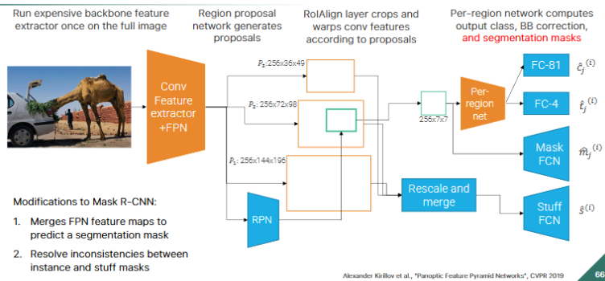

si basa su Mask R-CNN ma aggiunge una stuff head, se ci sono dei conflitti fra cio' che predice la mask head e cio' che predice la stuff head, ad esempio la prima dice che quel pixel e' un oggetto e la seconda che e' una stuff allora in quel caso viene data la precedente agli oggetti.
L'input della stuff head e' il merge FPN di features maps a diverse scale.

I risultati di questa network sono assurdamente buoni e anche se e' stata implementata nel 2019 e' la baseline di reti piu' moderne

## METRIC LEARNING 
si chiama metric learning perche' noi impariamo un concetto di distanza (funzione di distanza o metrica)

### FACE RECOGNITION 

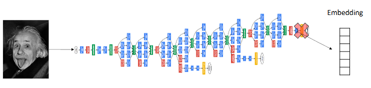

finora in tutte le network che abbiamo visto abbiamo la backbone che funge da features extractor e che riduce la risoluzione dell'immagine e poi le varie head di classificazione o altro, ora prendiamo solo la backbone e chiamiamo l'immagine a risoluzione minore che e' l'output della backbone il nostro embedding e poi potremmo fare una nearest neighbor search per trovare immagini semanticamente simili.
Questo vogliamo farlo per la face recognition quindi abbiamo un'immagine di una persona e vogliamo fare una query in un db per ottenere immagini della stessa persona, si chiama one-to-many matching problem perche' abbiamo una immagine query e vogliamo tante immagini come output 
problemi:
- il db dovrebbe contenere milioni di immagini di facce 
- il match dovrebbe essere robusto a cambi di espressioni o stili 

non possiamo vedere il problema di face recognition come un semplice problema di classificazione perche' l'head di classificazione dovrebbe contenere come canali tutti gli individui estistenti nel mondo e anche quelli morti, oppure se dobbiamo aggiungere una nuova faccia all'head dobbiamo buttare tutta la fase di training o comunque dovremmo fare un fine tuning.

L'idea e' di trainare una backbone su un grande dataset per ottenere un certo embedding e poi usare un semplice classificatore K-nearest Neighbors nell'embedding il tutto funziona solo se abbiamo un buon embedding che distribuisce in maniera discriminativa per il K-nearest Neighbors le immagini di persone.

La cross entropy loss non va bene perche' clusterizza gli embedding in maniera tale che siano linearmente separabili pero' distanze fra embedding della stessa classe puo' essere piu' grande rispetto a embedding di classi diverse e questo non va bene per il K nearest neighbor search.

L'idea e' di usare un concetto di similarita' fra persone e quindi un concetto di distanza fra persone, l'idea del metric learning e' di creare una loss che durante il training organizzi gli embedding in maniera tale che la distanza di similarita' fra embedding nella stessa classe sia minima e invece fra embedding di classi diverse sia massicciamente pero' per il calcolo della distanza servono almeno due immagini e quindi arriva la Siamese network

### SIAMESE NETWORK 

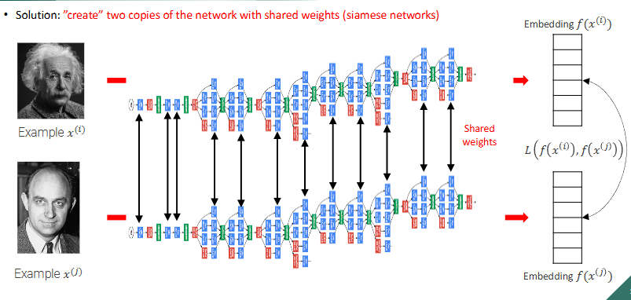

prendiamo due copie della stessa network che condividono i pesi e nel training le trainiamo ogni volta con due immagini in input diverse e usiamo la Contrastive Loss che realizza proprio il concetto di distanza intraclasse e interclasse che dicevo prima

$d(x_i, x_j)$ sarebbe la distanza fra due immagini 
se usiamo la distanza euclidea $d(xi, xj) = \| f(x_i) - f(x_j) \|_2$  $\quad \text{dove } f(x_i)$ e' l'embedding dell'input $x_i$

$$
L(f(x_i), f(x_j)) = \begin{cases}
\|f(x_i) - f(x_j)\|_2^2 & \text{se } y_{(i,j)} = +1 \quad \text{ovvero sono la stessa persona} \\
-\|f(x_i) - f(x_j)\|_2^2 & \text{se } y_{(i,j)} = 0 \quad \text{ovvero sono due persone diverse}
\end{cases}
$$

se sono la stessa persona minimizzi la distanza, se sono due persone diverse minimizzi il meno della distanza quindi massimizzi la distanza 

il problema di questa loss e' che il secondo termine se sono due persone diverse e tu aumenti questa distanza, questo termine e' unbounded quando capisci se hai aumentato abbastanza questa distanza, se le due persone sono sufficientemente distanti

allora introduciamo il concetto di margine m(sarebbe il classico treeshold) consideriamo tutte norme 2 e poi le facciamo al quadrato

$$
L(f(x_i), f(x_j)) = \begin{cases}
\|f(x_i) - f(x_j)\|_2^2 & \text{se } y_{(i,j)} = +1 \\
\max\{0, ({ \color{red}m } - \|f(x_i) - f(x_j)\|_2)\}^2 & \text{se } y_{(i,j)} = 0
\end{cases}
$$

l'idea col margine e' che con l'aggiunta di m l'idea sarebbe che se la distanza e' superiore a m allora prendiamo 0
quindi spingiamo le due immagini appartenenti a classi diverse fino a m perche' poi prendiamo 0 in caso e quindi non spingiamo piu'

### TRIPLET LOSS 

la Contrastive loss considera le coppie (Anchor-positivo), (Anchor-negativo) in maniera separata invece la triplet considera le relazioni fra le due distanze contemporaneamente, portando a embedding piu' strutturati.

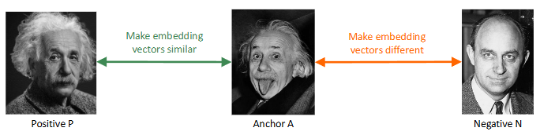

stesso discorso di contrastive loss in questo caso non prendiamo le triplette di immagini a caso ma abbiamo un anchor A che e' l'immagine che consideriamo e poi un'altra immagine P che sarebbe la positiva, un'altra immagine della stessa classe dell'anchor e poi l'immagine negativa N che sarebbe un'immagine di una classe diversa dell'anchor 

$$
\|f(P) - f(A)\|_2^2 < \|f(N) - f(A)\|_2^2
$$

stessa cosa la distanza fra l'anchor e il positivo deve essere minore (e quindi minima) rispetto alla distanza fra anchor e negativa (che quindi deve essere massima)

problema: 
non garantisce che anche la distanza fra positiva e negativa sia maggiore rispetto a fra anchor e positiva

Soluzione: aggiungi sempre il margine m

$$
\|f(P) - f(A)\|_2^2 +m < \|f(N) - f(A)\|_2^2 
$$

$$
\|f(P) - f(A)\|_2^2 - \|f(N) - f(A)\|_2^2 + m < 0
$$

che se la riscrivi come loss viene 
$$
L(A, P, N) = \max\{0, \|f(P) - f(A)\|_2^2 - \|f(N) - f(A)\|_2^2 + m\}
$$

#### TRAINING TRIPLET LOSS 
la parte piu' importante riguardo la triplet loss e' che durante il training bisogna scegliere le giuste triple, in particolare il negative example vogliamo scegliere per il batch
- hard triplets, il negative e' vicino (nell'embedding space o spazio latente) all'anchor rispetto al positivo (questo e' un hard triplet perche'
questo caso indica che il modello ha sbagliato tanto nell'embedding)

- semi-hard triplets, il negative e' abbastanza lontano dall'anchor se non consideriamo il margin, se consideriamo il margin invece e' verificata  $d(A,N) < d(A,P) + m$     quindi non e' ancora abbastanza lontano rispetto all'anchor

quindi il training funziona che a ogni epoca ti calcoli gli embedding relativi a ogni immagine e poi ti crei le possibili coppie (A,P) e poi scegli i negative per creare le hard triplets e semi hard triplets.
In realta' si e' visto che per il training non va bene usare gli hard triplets perche' portava a un training scarso perche' il training era dominato da mislabeled o immagini a scarsa risoluzione quindi per il training si usano solo i semi-hard triplets.

#### USI 

Metric learning e' usato ad esempio per tracciare gli spostamenti di una persona in immagini prese da diverse telecamere di sorveglianza quindi a diverse prospettive o background o anche ad esempio per fare la ricerca per immagini su google

### DOMANDE
##### differenza fra istance level object detection e category object detection
La istance level object detection cerca di individuare in una immagine l'istanza di un oggetto (ad esempio un libro giallo specifico), questo task e' piu' facile perche' devi controllare una cosa specifica invece la category object detection cerca di classificare la categoria libro, e' piu' astratta e piu' difficile e quindi richiede le reti neurali (oppure anche classic vision con ad esempio Viola Jones), l'istance level object detection l'abbiamo fatto nel secondo lab in cui sostanzialmente abbiamo preso l'immagine di riferimento che era un libro e volevamo detectarlo in 5 immagini target, abbiamo calcolato con sift i descrittori nelle varie immagini, poi abbiamo usato i k d tree per fare il match della similarita' e validando solo i match buoni e poi se in ogni immagine il numero di match buoni era superiore a una soglia allora in quell'immagine era presente il libro